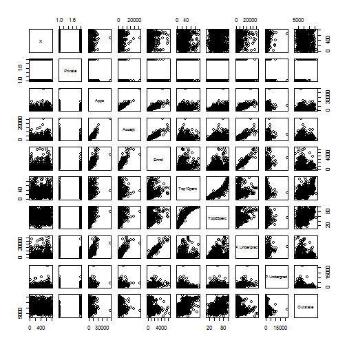
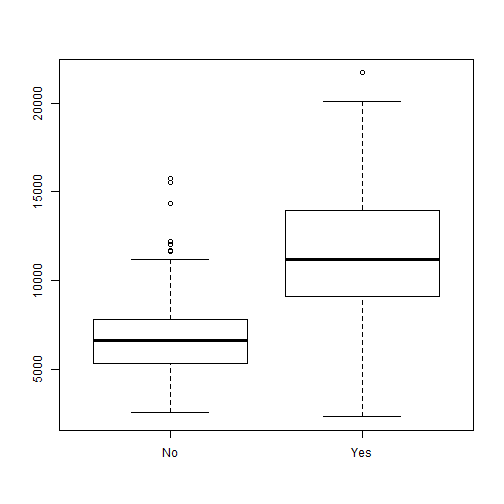
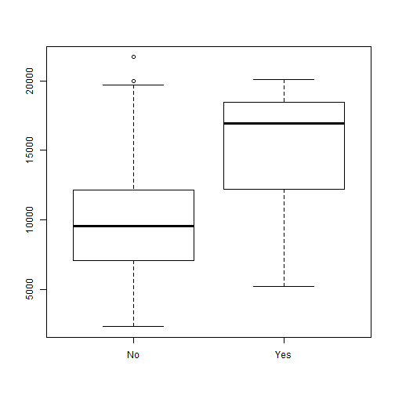
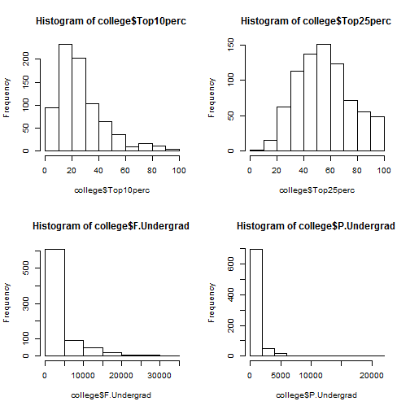

(a) Read data

```r
college <- read.csv("College.csv")
```

(b) Change row names and look at the data

```r
rownames(college) <- college[,1]
fix(college)
```

(c) Further explore data

```r
#i
summary(college)
```

```
##                             X       Private        Apps      
##  Abilene Christian University:  1   No :212   Min.   :   81  
##  Adelphi University          :  1   Yes:565   1st Qu.:  776  
##  Adrian College              :  1             Median : 1558  
##  Agnes Scott College         :  1             Mean   : 3002  
##  Alaska Pacific University   :  1             3rd Qu.: 3624  
##  Albertson College           :  1             Max.   :48094  
##  (Other)                     :771                            
##      Accept          Enroll       Top10perc       Top25perc    
##  Min.   :   72   Min.   :  35   Min.   : 1.00   Min.   :  9.0  
##  1st Qu.:  604   1st Qu.: 242   1st Qu.:15.00   1st Qu.: 41.0  
##  Median : 1110   Median : 434   Median :23.00   Median : 54.0  
##  Mean   : 2019   Mean   : 780   Mean   :27.56   Mean   : 55.8  
##  3rd Qu.: 2424   3rd Qu.: 902   3rd Qu.:35.00   3rd Qu.: 69.0  
##  Max.   :26330   Max.   :6392   Max.   :96.00   Max.   :100.0  
##                                                                
##   F.Undergrad     P.Undergrad         Outstate       Room.Board  
##  Min.   :  139   Min.   :    1.0   Min.   : 2340   Min.   :1780  
##  1st Qu.:  992   1st Qu.:   95.0   1st Qu.: 7320   1st Qu.:3597  
##  Median : 1707   Median :  353.0   Median : 9990   Median :4200  
##  Mean   : 3700   Mean   :  855.3   Mean   :10441   Mean   :4358  
##  3rd Qu.: 4005   3rd Qu.:  967.0   3rd Qu.:12925   3rd Qu.:5050  
##  Max.   :31643   Max.   :21836.0   Max.   :21700   Max.   :8124  
##                                                                  
##      Books           Personal         PhD            Terminal    
##  Min.   :  96.0   Min.   : 250   Min.   :  8.00   Min.   : 24.0  
##  1st Qu.: 470.0   1st Qu.: 850   1st Qu.: 62.00   1st Qu.: 71.0  
##  Median : 500.0   Median :1200   Median : 75.00   Median : 82.0  
##  Mean   : 549.4   Mean   :1341   Mean   : 72.66   Mean   : 79.7  
##  3rd Qu.: 600.0   3rd Qu.:1700   3rd Qu.: 85.00   3rd Qu.: 92.0  
##  Max.   :2340.0   Max.   :6800   Max.   :103.00   Max.   :100.0  
##                                                                  
##    S.F.Ratio      perc.alumni        Expend        Grad.Rate     
##  Min.   : 2.50   Min.   : 0.00   Min.   : 3186   Min.   : 10.00  
##  1st Qu.:11.50   1st Qu.:13.00   1st Qu.: 6751   1st Qu.: 53.00  
##  Median :13.60   Median :21.00   Median : 8377   Median : 65.00  
##  Mean   :14.09   Mean   :22.74   Mean   : 9660   Mean   : 65.46  
##  3rd Qu.:16.50   3rd Qu.:31.00   3rd Qu.:10830   3rd Qu.: 78.00  
##  Max.   :39.80   Max.   :64.00   Max.   :56233   Max.   :118.00  
## 
```

```r
#ii
pairs(college[,1:10])
```

 

```r
#iii
plot(college$Private,college$Outstate)
```

 

```r
#iV
Elite <- rep("No",nrow(college))
Elite[college$Top10perc>50] <- "Yes"
Elite <- as.factor(Elite)
college <- data.frame(college,Elite)
summary(college)
```

```
##                             X       Private        Apps      
##  Abilene Christian University:  1   No :212   Min.   :   81  
##  Adelphi University          :  1   Yes:565   1st Qu.:  776  
##  Adrian College              :  1             Median : 1558  
##  Agnes Scott College         :  1             Mean   : 3002  
##  Alaska Pacific University   :  1             3rd Qu.: 3624  
##  Albertson College           :  1             Max.   :48094  
##  (Other)                     :771                            
##      Accept          Enroll       Top10perc       Top25perc    
##  Min.   :   72   Min.   :  35   Min.   : 1.00   Min.   :  9.0  
##  1st Qu.:  604   1st Qu.: 242   1st Qu.:15.00   1st Qu.: 41.0  
##  Median : 1110   Median : 434   Median :23.00   Median : 54.0  
##  Mean   : 2019   Mean   : 780   Mean   :27.56   Mean   : 55.8  
##  3rd Qu.: 2424   3rd Qu.: 902   3rd Qu.:35.00   3rd Qu.: 69.0  
##  Max.   :26330   Max.   :6392   Max.   :96.00   Max.   :100.0  
##                                                                
##   F.Undergrad     P.Undergrad         Outstate       Room.Board  
##  Min.   :  139   Min.   :    1.0   Min.   : 2340   Min.   :1780  
##  1st Qu.:  992   1st Qu.:   95.0   1st Qu.: 7320   1st Qu.:3597  
##  Median : 1707   Median :  353.0   Median : 9990   Median :4200  
##  Mean   : 3700   Mean   :  855.3   Mean   :10441   Mean   :4358  
##  3rd Qu.: 4005   3rd Qu.:  967.0   3rd Qu.:12925   3rd Qu.:5050  
##  Max.   :31643   Max.   :21836.0   Max.   :21700   Max.   :8124  
##                                                                  
##      Books           Personal         PhD            Terminal    
##  Min.   :  96.0   Min.   : 250   Min.   :  8.00   Min.   : 24.0  
##  1st Qu.: 470.0   1st Qu.: 850   1st Qu.: 62.00   1st Qu.: 71.0  
##  Median : 500.0   Median :1200   Median : 75.00   Median : 82.0  
##  Mean   : 549.4   Mean   :1341   Mean   : 72.66   Mean   : 79.7  
##  3rd Qu.: 600.0   3rd Qu.:1700   3rd Qu.: 85.00   3rd Qu.: 92.0  
##  Max.   :2340.0   Max.   :6800   Max.   :103.00   Max.   :100.0  
##                                                                  
##    S.F.Ratio      perc.alumni        Expend        Grad.Rate     
##  Min.   : 2.50   Min.   : 0.00   Min.   : 3186   Min.   : 10.00  
##  1st Qu.:11.50   1st Qu.:13.00   1st Qu.: 6751   1st Qu.: 53.00  
##  Median :13.60   Median :21.00   Median : 8377   Median : 65.00  
##  Mean   :14.09   Mean   :22.74   Mean   : 9660   Mean   : 65.46  
##  3rd Qu.:16.50   3rd Qu.:31.00   3rd Qu.:10830   3rd Qu.: 78.00  
##  Max.   :39.80   Max.   :64.00   Max.   :56233   Max.   :118.00  
##                                                                  
##  Elite    
##  No :699  
##  Yes: 78  
##           
##           
##           
##           
## 
```

```r
plot(college$Elite,college$Outstate)
```

 

```r
#v
par(mfrow=c(2,2))
hist(college$Top10perc)
hist(college$Top25perc)
hist(college$F.Undergrad)
hist(college$P.Undergrad)
```

 

```r
#vi
```
