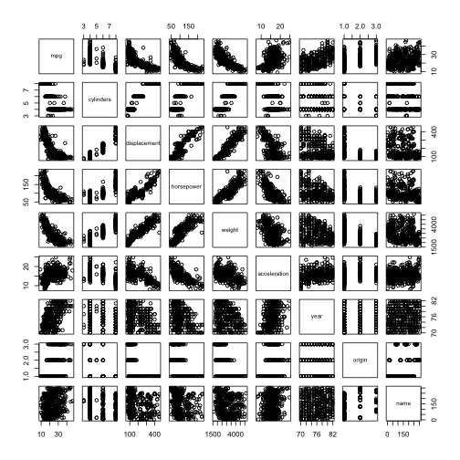
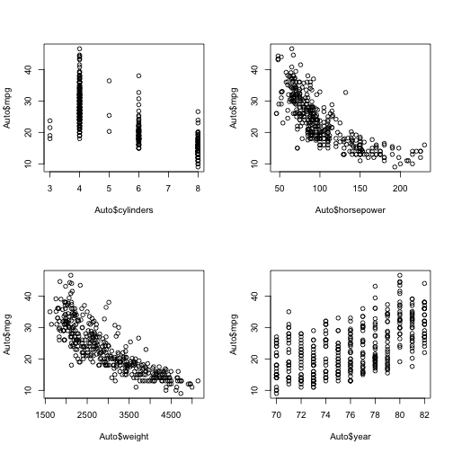

### (a) Get predictor types

```r
Auto <- read.table("Auto.data",header = T,na.strings = "?")
Auto <- na.omit(Auto)
summary(Auto)
```

```
##       mpg          cylinders      displacement     horsepower   
##  Min.   : 9.00   Min.   :3.000   Min.   : 68.0   Min.   : 46.0  
##  1st Qu.:17.00   1st Qu.:4.000   1st Qu.:105.0   1st Qu.: 75.0  
##  Median :22.75   Median :4.000   Median :151.0   Median : 93.5  
##  Mean   :23.45   Mean   :5.472   Mean   :194.4   Mean   :104.5  
##  3rd Qu.:29.00   3rd Qu.:8.000   3rd Qu.:275.8   3rd Qu.:126.0  
##  Max.   :46.60   Max.   :8.000   Max.   :455.0   Max.   :230.0  
##                                                                 
##      weight      acceleration        year           origin     
##  Min.   :1613   Min.   : 8.00   Min.   :70.00   Min.   :1.000  
##  1st Qu.:2225   1st Qu.:13.78   1st Qu.:73.00   1st Qu.:1.000  
##  Median :2804   Median :15.50   Median :76.00   Median :1.000  
##  Mean   :2978   Mean   :15.54   Mean   :75.98   Mean   :1.577  
##  3rd Qu.:3615   3rd Qu.:17.02   3rd Qu.:79.00   3rd Qu.:2.000  
##  Max.   :5140   Max.   :24.80   Max.   :82.00   Max.   :3.000  
##                                                                
##                  name    
##  amc matador       :  5  
##  ford pinto        :  5  
##  toyota corolla    :  5  
##  amc gremlin       :  4  
##  amc hornet        :  4  
##  chevrolet chevette:  4  
##  (Other)           :365
```

We can see that qualitative predictors is name, and others are quantitative predictors.

### (b) Find the range for each quantitative predictor

```r
ranges <- matrix(0,8,2)
for (i in 1:8) {
  ranges[i,] <- t(range(Auto[,i]))
}
ranges <- data.frame(ranges)
rownames(ranges) <- names(Auto)[1:8]
colnames(ranges) <- c("low","high")
ranges
```

```
##               low   high
## mpg             9   46.6
## cylinders       3    8.0
## displacement   68  455.0
## horsepower     46  230.0
## weight       1613 5140.0
## acceleration    8   24.8
## year           70   82.0
## origin          1    3.0
```

### (c) Find the mean and standard deviation for each quantitative predictor

```r
stats <- matrix(0,8,2)
for (i in 1:8) {
  stats[i,1] <- mean(Auto[,i])
  stats[i,2] <- sd(Auto[,i])
}
stats <- data.frame(stats)
rownames(stats) <- names(Auto)[1:8]
colnames(stats) <- c("mean","std")
stats
```

```
##                     mean         std
## mpg            23.445918   7.8050075
## cylinders       5.471939   1.7057832
## displacement  194.411990 104.6440039
## horsepower    104.469388  38.4911599
## weight       2977.584184 849.4025600
## acceleration   15.541327   2.7588641
## year           75.979592   3.6837365
## origin          1.576531   0.8055182
```

### (d) Redo part (c) after removing 10th through 85th observations

```r
Auto.sub <- Auto[-c(10:85),]
stats <- matrix(0,8,2)
for (i in 1:8) {
  stats[i,1] <- mean(Auto.sub[,i])
  stats[i,2] <- sd(Auto.sub[,i])
}
stats <- data.frame(stats)
rownames(stats) <- names(Auto.sub)[1:8]
colnames(stats) <- c("mean","std")
stats
```

```
##                     mean        std
## mpg            24.404430   7.867283
## cylinders       5.373418   1.654179
## displacement  187.240506  99.678367
## horsepower    100.721519  35.708853
## weight       2935.971519 811.300208
## acceleration   15.726899   2.693721
## year           77.145570   3.106217
## origin          1.601266   0.819910
```

### (e) Investigate some relationships

```r
pairs(Auto)
```

 

```r
par(mfrow=c(2,2))
plot(Auto$cylinders,Auto$mpg)
plot(Auto$horsepower,Auto$mpg)
plot(Auto$weight,Auto$mpg)
plot(Auto$year,Auto$mpg)
```

 

### (f) From the panel shown above, those 4 variables could be helpful to forecast mpg.
