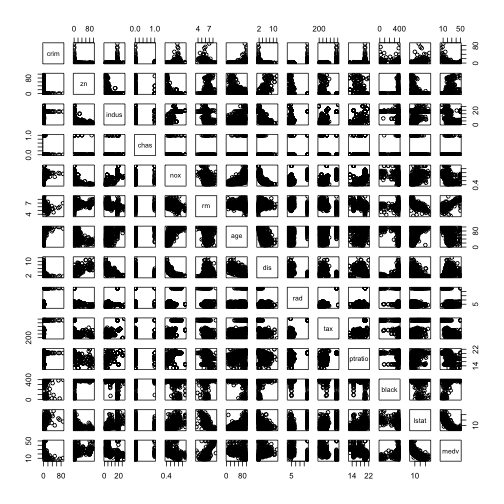

### (a) Load the Boston data

```r
library(MASS)
show(?Boston)
```

### (b) Make pairwise scatterplots

```r
pairs(Boston)
```

 

### (c) From the scatterplots, rad and tax seem to be some related predictors. Higher rad or tax may lead to higher crime.

### (d) Find the ranges for some predictors

```r
ranges <- matrix(0,3,2)
ranges[1,] <- t(range(Boston$crim))
ranges[2,] <- t(range(Boston$tax))
ranges[3,] <- t(range(Boston$ptratio))
ranges <- data.frame(ranges)
rownames(ranges) <- c("crime rates","tax rates","pupil-teacher rates")
colnames(ranges) <- c("low","high")
ranges
```

```
##                          low     high
## crime rates         6.32e-03  88.9762
## tax rates           1.87e+02 711.0000
## pupil-teacher rates 1.26e+01  22.0000
```

It is clear that crime rates and tax rates differ a lot, while pupil-teacher rates have a relatively small range.

### (e) Total number of suburbs bound the Charles river

```r
sum(Boston$chas)
```

```
## [1] 35
```

### (f) Median pupil-teacher ratio

```r
median(Boston$ptratio)
```

```
## [1] 19.05
```

### (g) The suburb with the lowest median value of owner-occupied homes

```r
Boston.lowMedv <- Boston[which(Boston$medv==min(Boston$medv)),]
num <- length(Boston.lowMedv[,1])
for (i in 1:length(names(Boston))) {
  Boston.lowMedv[c(num+1,num+2),i]<-range(Boston[,i])
}
rownames(Boston.lowMedv)[c(num+1,num+2)] <- c("low","high")
Boston.lowMedv
```

```
##          crim  zn indus chas   nox    rm   age     dis rad tax ptratio
## 399  38.35180   0 18.10    0 0.693 5.453 100.0  1.4896  24 666    20.2
## 406  67.92080   0 18.10    0 0.693 5.683 100.0  1.4254  24 666    20.2
## low   0.00632   0  0.46    0 0.385 3.561   2.9  1.1296   1 187    12.6
## high 88.97620 100 27.74    1 0.871 8.780 100.0 12.1265  24 711    22.0
##       black lstat medv
## 399  396.90 30.59    5
## 406  384.97 22.98    5
## low    0.32  1.73    5
## high 396.90 37.97   50
```

### (g) Number of suburbs regarding rooms per dwelling
Number of suburbs with rm more than 7:

```r
sum(Boston$rm>7)
```

```
## [1] 64
```

Number of suburbs with rm more than 8:

```r
sum(Boston$rm>8)
```

```
## [1] 13
```

Details of those with rm more than 8:

```r
Boston.highRm <- Boston[Boston$rm>8,]
num <- length(Boston.highRm[,1])
for (i in 1:length(names(Boston))) {
  Boston.highRm[c(num+1,num+2),i]<-range(Boston[,i])
}
rownames(Boston.highRm)[c(num+1,num+2)] <- c("low","high")
Boston.highRm
```

```
##          crim  zn indus chas    nox    rm   age     dis rad tax ptratio
## 98    0.12083   0  2.89    0 0.4450 8.069  76.0  3.4952   2 276    18.0
## 164   1.51902   0 19.58    1 0.6050 8.375  93.9  2.1620   5 403    14.7
## 205   0.02009  95  2.68    0 0.4161 8.034  31.9  5.1180   4 224    14.7
## 225   0.31533   0  6.20    0 0.5040 8.266  78.3  2.8944   8 307    17.4
## 226   0.52693   0  6.20    0 0.5040 8.725  83.0  2.8944   8 307    17.4
## 227   0.38214   0  6.20    0 0.5040 8.040  86.5  3.2157   8 307    17.4
## 233   0.57529   0  6.20    0 0.5070 8.337  73.3  3.8384   8 307    17.4
## 234   0.33147   0  6.20    0 0.5070 8.247  70.4  3.6519   8 307    17.4
## 254   0.36894  22  5.86    0 0.4310 8.259   8.4  8.9067   7 330    19.1
## 258   0.61154  20  3.97    0 0.6470 8.704  86.9  1.8010   5 264    13.0
## 263   0.52014  20  3.97    0 0.6470 8.398  91.5  2.2885   5 264    13.0
## 268   0.57834  20  3.97    0 0.5750 8.297  67.0  2.4216   5 264    13.0
## 365   3.47428   0 18.10    1 0.7180 8.780  82.9  1.9047  24 666    20.2
## low   0.00632   0  0.46    0 0.3850 3.561   2.9  1.1296   1 187    12.6
## high 88.97620 100 27.74    1 0.8710 8.780 100.0 12.1265  24 711    22.0
##       black lstat medv
## 98   396.90  4.21 38.7
## 164  388.45  3.32 50.0
## 205  390.55  2.88 50.0
## 225  385.05  4.14 44.8
## 226  382.00  4.63 50.0
## 227  387.38  3.13 37.6
## 233  385.91  2.47 41.7
## 234  378.95  3.95 48.3
## 254  396.90  3.54 42.8
## 258  389.70  5.12 50.0
## 263  386.86  5.91 48.8
## 268  384.54  7.44 50.0
## 365  354.55  5.29 21.9
## low    0.32  1.73  5.0
## high 396.90 37.97 50.0
```
