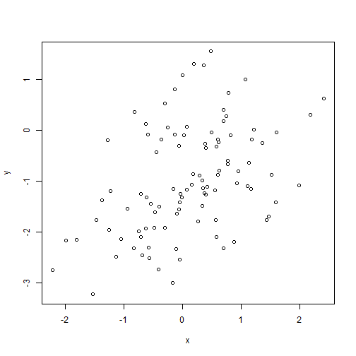
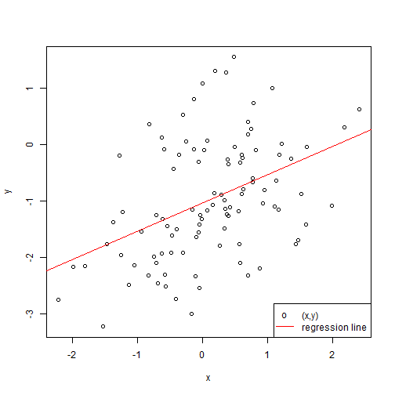
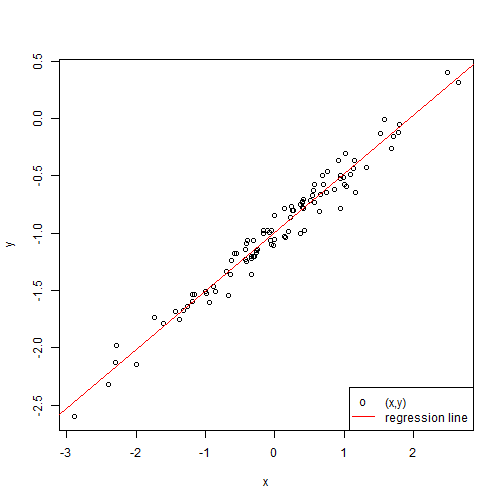
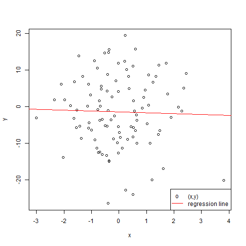

#### Preparation

```r
set.seed(1)
```

### (a) Create x

```r
x <- rnorm(100)
```

### (b) Create eps

```r
eps <- rnorm(100)
```

### (c) Generate y

```r
y <- -1+0.5*x+eps
length(y)
```

```
## [1] 100
```

In this liner model, /beta_0 is -1, /beta_1 is 0.5.

### (d) Scatterplot

```r
plot(x,y)
```

 

The relationship between x and y is not clear from the plot, but somehow it shows that higher x leads to higher y.

### (e) Fit a least squares linear model

```r
lm.fit <- lm(y ~ x)
summary(lm.fit)
```

```
## 
## Call:
## lm(formula = y ~ x)
## 
## Residuals:
##     Min      1Q  Median      3Q     Max 
## -1.8768 -0.6138 -0.1395  0.5394  2.3462 
## 
## Coefficients:
##             Estimate Std. Error t value Pr(>|t|)    
## (Intercept) -1.03769    0.09699 -10.699  < 2e-16 ***
## x            0.49894    0.10773   4.632 1.12e-05 ***
## ---
## Signif. codes:  0 '***' 0.001 '**' 0.01 '*' 0.05 '.' 0.1 ' ' 1
## 
## Residual standard error: 0.9628 on 98 degrees of freedom
## Multiple R-squared:  0.1796,	Adjusted R-squared:  0.1712 
## F-statistic: 21.45 on 1 and 98 DF,  p-value: 1.117e-05
```

The estimates are very close to the real values of coefficients.

### (f) Display the regression line

```r
plot(x,y)
abline(lm.fit, col = "red")
legend("bottomright",c("(x,y)","regression line"),col=c("black","red"),pch=c("o",""),lty=0:1)
```

 

### (g) Fit a polynomial regression model

```r
lm.fit.quad <- lm(y ~ poly(x,2))
summary(lm.fit.quad)
```

```
## 
## Call:
## lm(formula = y ~ poly(x, 2))
## 
## Residuals:
##     Min      1Q  Median      3Q     Max 
## -1.9650 -0.6254 -0.1288  0.5803  2.2700 
## 
## Coefficients:
##             Estimate Std. Error t value Pr(>|t|)    
## (Intercept)  -0.9834     0.0958 -10.264  < 2e-16 ***
## poly(x, 2)1   4.4590     0.9580   4.654 1.03e-05 ***
## poly(x, 2)2  -1.3441     0.9580  -1.403    0.164    
## ---
## Signif. codes:  0 '***' 0.001 '**' 0.01 '*' 0.05 '.' 0.1 ' ' 1
## 
## Residual standard error: 0.958 on 97 degrees of freedom
## Multiple R-squared:  0.1959,	Adjusted R-squared:  0.1793 
## F-statistic: 11.82 on 2 and 97 DF,  p-value: 2.557e-05
```

The polynomial model has slightly higher R-square, but the quadratic term is not significant. SO the model may not perform better.

### (h) Refit linear model with less noise

```r
x <- rnorm(100)
eps <- rnorm(100,sd=0.1)
y <- -1+0.5*x+eps
lm.fit.less <- lm(y ~ x)
summary(lm.fit.less)
```

```
## 
## Call:
## lm(formula = y ~ x)
## 
## Residuals:
##       Min        1Q    Median        3Q       Max 
## -0.274179 -0.056139 -0.001749  0.067973  0.184843 
## 
## Coefficients:
##              Estimate Std. Error t value Pr(>|t|)    
## (Intercept) -0.995155   0.009910 -100.42   <2e-16 ***
## x            0.510622   0.009626   53.05   <2e-16 ***
## ---
## Signif. codes:  0 '***' 0.001 '**' 0.01 '*' 0.05 '.' 0.1 ' ' 1
## 
## Residual standard error: 0.09906 on 98 degrees of freedom
## Multiple R-squared:  0.9663,	Adjusted R-squared:  0.966 
## F-statistic:  2814 on 1 and 98 DF,  p-value: < 2.2e-16
```

```r
plot(x,y)
abline(lm.fit.less, col = "red")
legend("bottomright",c("(x,y)","regression line"),col=c("black","red"),pch=c("o",""),lty=0:1)
```

 

The linear model seems to fit even better.

### (i) Refit linear model with more noise

```r
x <- rnorm(100)
eps <- rnorm(100,sd=10)
y <- -1+0.5*x+eps
lm.fit.more <- lm(y ~ x)
summary(lm.fit.more)
```

```
## 
## Call:
## lm(formula = y ~ x)
## 
## Residuals:
##      Min       1Q   Median       3Q      Max 
## -25.1014  -6.0549   0.2065   7.0483  20.8980 
## 
## Coefficients:
##             Estimate Std. Error t value Pr(>|t|)
## (Intercept)  -1.4745     0.9676  -1.524    0.131
## x            -0.2495     0.8310  -0.300    0.765
## 
## Residual standard error: 9.671 on 98 degrees of freedom
## Multiple R-squared:  0.0009189,	Adjusted R-squared:  -0.009276 
## F-statistic: 0.09013 on 1 and 98 DF,  p-value: 0.7646
```

```r
plot(x,y)
abline(lm.fit.more, col = "red")
legend("bottomright",c("(x,y)","regression line"),col=c("black","red"),pch=c("o",""),lty=0:1)
```

 

The linear model does not fit so well in this case.

### (j) Confidence intervals

```r
confint(lm.fit)
```

```
##                  2.5 %     97.5 %
## (Intercept) -1.2301607 -0.8452245
## x            0.2851588  0.7127204
```

```r
confint(lm.fit.less)
```

```
##                  2.5 %     97.5 %
## (Intercept) -1.0148210 -0.9754890
## x            0.4915195  0.5297242
```

```r
confint(lm.fit.more)
```

```
##                 2.5 %    97.5 %
## (Intercept) -3.394772 0.4457235
## x           -1.898609 1.3996316
```

Clearly, when the noise is smaller, the confidence interval is narrower.
