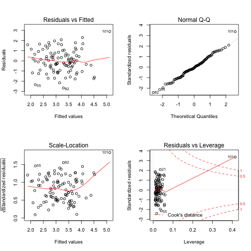

### (a) Linear model

```r
set.seed(1)
x1 <- runif(100)
x2 <- 0.5*x1+rnorm(100)/10
y <- 2+2*x1+0.3*x2+rnorm(100)
```

The model is: y=2+2 * x1+0.3 * x2

### (b) Relationship between variables

```r
cor(x1,x2)
```

```
## [1] 0.8351212
```

```r
plot(x1,x2)
```

 

### (c) Least square regression

```r
lm.fit <- lm(y ~ x1+x2)
summary(lm.fit)
```

```
## 
## Call:
## lm(formula = y ~ x1 + x2)
## 
## Residuals:
##     Min      1Q  Median      3Q     Max 
## -2.8311 -0.7273 -0.0537  0.6338  2.3359 
## 
## Coefficients:
##             Estimate Std. Error t value Pr(>|t|)    
## (Intercept)   2.1305     0.2319   9.188 7.61e-15 ***
## x1            1.4396     0.7212   1.996   0.0487 *  
## x2            1.0097     1.1337   0.891   0.3754    
## ---
## Signif. codes:  0 '***' 0.001 '**' 0.01 '*' 0.05 '.' 0.1 ' ' 1
## 
## Residual standard error: 1.056 on 97 degrees of freedom
## Multiple R-squared:  0.2088,	Adjusted R-squared:  0.1925 
## F-statistic:  12.8 on 2 and 97 DF,  p-value: 1.164e-05
```

Only beta_0 is significant, and beta_1 is acceptable. The coefficient estimates of x1 and x2 are not so close to the actual coefficient. We can reject the null hypothesis for beta_1, but not for beta_2.

### (d) Least square regression using only x1

```r
lm.fit1 <- lm(y ~ x1)
summary(lm.fit1)
```

```
## 
## Call:
## lm(formula = y ~ x1)
## 
## Residuals:
##      Min       1Q   Median       3Q      Max 
## -2.89495 -0.66874 -0.07785  0.59221  2.45560 
## 
## Coefficients:
##             Estimate Std. Error t value Pr(>|t|)    
## (Intercept)   2.1124     0.2307   9.155 8.27e-15 ***
## x1            1.9759     0.3963   4.986 2.66e-06 ***
## ---
## Signif. codes:  0 '***' 0.001 '**' 0.01 '*' 0.05 '.' 0.1 ' ' 1
## 
## Residual standard error: 1.055 on 98 degrees of freedom
## Multiple R-squared:  0.2024,	Adjusted R-squared:  0.1942 
## F-statistic: 24.86 on 1 and 98 DF,  p-value: 2.661e-06
```

This time beta_1 is much more significant, and we can reject the null hypothesis for it.

### (e) Least square regression using only x2

```r
lm.fit2 <- lm(y ~ x2)
summary(lm.fit2)
```

```
## 
## Call:
## lm(formula = y ~ x2)
## 
## Residuals:
##      Min       1Q   Median       3Q      Max 
## -2.62687 -0.75156 -0.03598  0.72383  2.44890 
## 
## Coefficients:
##             Estimate Std. Error t value Pr(>|t|)    
## (Intercept)   2.3899     0.1949   12.26  < 2e-16 ***
## x2            2.8996     0.6330    4.58 1.37e-05 ***
## ---
## Signif. codes:  0 '***' 0.001 '**' 0.01 '*' 0.05 '.' 0.1 ' ' 1
## 
## Residual standard error: 1.072 on 98 degrees of freedom
## Multiple R-squared:  0.1763,	Adjusted R-squared:  0.1679 
## F-statistic: 20.98 on 1 and 98 DF,  p-value: 1.366e-05
```

This time beta_2 is much much more significant, and we can reject the null hypothesis for it.

### (f) These results shown below don't contradict each other, because x1 and x2 are highly correlated.

### (g) Refit with an additional observation

```r
x1 <- c(x1,0.1)
x2 <- c(x2,0.8)
y <- c(y,8)
lm.fit <- lm(y ~ x1+x2)
summary(lm.fit)
```

```
## 
## Call:
## lm(formula = y ~ x1 + x2)
## 
## Residuals:
##      Min       1Q   Median       3Q      Max 
## -2.66655 -0.69571 -0.09824  0.75928  2.87825 
## 
## Coefficients:
##             Estimate Std. Error t value Pr(>|t|)    
## (Intercept)  2.29263    0.24055   9.531 1.26e-15 ***
## x1          -0.07754    0.61572  -0.126 0.900041    
## x2           3.54609    0.93335   3.799 0.000252 ***
## ---
## Signif. codes:  0 '***' 0.001 '**' 0.01 '*' 0.05 '.' 0.1 ' ' 1
## 
## Residual standard error: 1.117 on 98 degrees of freedom
## Multiple R-squared:  0.2362,	Adjusted R-squared:  0.2206 
## F-statistic: 15.15 on 2 and 98 DF,  p-value: 1.848e-06
```

```r
par(mfrow=c(2,2))
plot(lm.fit)
```

 

```r
lm.fit1 <- lm(y ~ x1)
summary(lm.fit1)
```

```
## 
## Call:
## lm(formula = y ~ x1)
## 
## Residuals:
##     Min      1Q  Median      3Q     Max 
## -2.8868 -0.6586 -0.1196  0.5708  5.4996 
## 
## Coefficients:
##             Estimate Std. Error t value Pr(>|t|)    
## (Intercept)   2.3353     0.2561   9.120  9.1e-15 ***
## x1            1.6517     0.4419   3.738 0.000311 ***
## ---
## Signif. codes:  0 '***' 0.001 '**' 0.01 '*' 0.05 '.' 0.1 ' ' 1
## 
## Residual standard error: 1.191 on 99 degrees of freedom
## Multiple R-squared:  0.1237,	Adjusted R-squared:  0.1148 
## F-statistic: 13.97 on 1 and 99 DF,  p-value: 0.0003108
```

```r
par(mfrow=c(2,2))
plot(lm.fit1)
```

 

```r
lm.fit2 <- lm(y ~ x2)
summary(lm.fit2)
```

```
## 
## Call:
## lm(formula = y ~ x2)
## 
## Residuals:
##     Min      1Q  Median      3Q     Max 
## -2.6789 -0.6924 -0.1012  0.7439  2.9570 
## 
## Coefficients:
##             Estimate Std. Error t value Pr(>|t|)    
## (Intercept)   2.2756     0.1980  11.493  < 2e-16 ***
## x2            3.4592     0.6254   5.531  2.6e-07 ***
## ---
## Signif. codes:  0 '***' 0.001 '**' 0.01 '*' 0.05 '.' 0.1 ' ' 1
## 
## Residual standard error: 1.112 on 99 degrees of freedom
## Multiple R-squared:  0.2361,	Adjusted R-squared:  0.2283 
## F-statistic: 30.59 on 1 and 99 DF,  p-value: 2.601e-07
```

```r
par(mfrow=c(2,2))
plot(lm.fit2)
```

 

* We can see that only the result from model (c) has changed a lot.
* The observation is an outlier in model (c) and (d).
* The observation is a high-leverage point in model (c).
