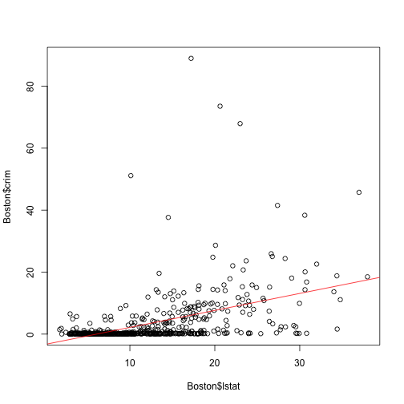

### (a) Simple linear regression models

```r
library(MASS)
predictor <- names(Boston)
predictor <- predictor[-1]
coef_uni <- c()
for (x in predictor) {
  lm.fit <- lm(Boston$crim~Boston[,x])
  show(x)
  show(summary(lm.fit))
  coef_uni <- c(coef_uni,coef(lm.fit)[2])
}
```

```
## [1] "zn"
## 
## Call:
## lm(formula = Boston$crim ~ Boston[, x])
## 
## Residuals:
##    Min     1Q Median     3Q    Max 
## -4.429 -4.222 -2.620  1.250 84.523 
## 
## Coefficients:
##             Estimate Std. Error t value Pr(>|t|)    
## (Intercept)  4.45369    0.41722  10.675  < 2e-16 ***
## Boston[, x] -0.07393    0.01609  -4.594 5.51e-06 ***
## ---
## Signif. codes:  0 '***' 0.001 '**' 0.01 '*' 0.05 '.' 0.1 ' ' 1
## 
## Residual standard error: 8.435 on 504 degrees of freedom
## Multiple R-squared:  0.04019,	Adjusted R-squared:  0.03828 
## F-statistic:  21.1 on 1 and 504 DF,  p-value: 5.506e-06
## 
## [1] "indus"
## 
## Call:
## lm(formula = Boston$crim ~ Boston[, x])
## 
## Residuals:
##     Min      1Q  Median      3Q     Max 
## -11.972  -2.698  -0.736   0.712  81.813 
## 
## Coefficients:
##             Estimate Std. Error t value Pr(>|t|)    
## (Intercept) -2.06374    0.66723  -3.093  0.00209 ** 
## Boston[, x]  0.50978    0.05102   9.991  < 2e-16 ***
## ---
## Signif. codes:  0 '***' 0.001 '**' 0.01 '*' 0.05 '.' 0.1 ' ' 1
## 
## Residual standard error: 7.866 on 504 degrees of freedom
## Multiple R-squared:  0.1653,	Adjusted R-squared:  0.1637 
## F-statistic: 99.82 on 1 and 504 DF,  p-value: < 2.2e-16
## 
## [1] "chas"
## 
## Call:
## lm(formula = Boston$crim ~ Boston[, x])
## 
## Residuals:
##    Min     1Q Median     3Q    Max 
## -3.738 -3.661 -3.435  0.018 85.232 
## 
## Coefficients:
##             Estimate Std. Error t value Pr(>|t|)    
## (Intercept)   3.7444     0.3961   9.453   <2e-16 ***
## Boston[, x]  -1.8928     1.5061  -1.257    0.209    
## ---
## Signif. codes:  0 '***' 0.001 '**' 0.01 '*' 0.05 '.' 0.1 ' ' 1
## 
## Residual standard error: 8.597 on 504 degrees of freedom
## Multiple R-squared:  0.003124,	Adjusted R-squared:  0.001146 
## F-statistic: 1.579 on 1 and 504 DF,  p-value: 0.2094
## 
## [1] "nox"
## 
## Call:
## lm(formula = Boston$crim ~ Boston[, x])
## 
## Residuals:
##     Min      1Q  Median      3Q     Max 
## -12.371  -2.738  -0.974   0.559  81.728 
## 
## Coefficients:
##             Estimate Std. Error t value Pr(>|t|)    
## (Intercept)  -13.720      1.699  -8.073 5.08e-15 ***
## Boston[, x]   31.249      2.999  10.419  < 2e-16 ***
## ---
## Signif. codes:  0 '***' 0.001 '**' 0.01 '*' 0.05 '.' 0.1 ' ' 1
## 
## Residual standard error: 7.81 on 504 degrees of freedom
## Multiple R-squared:  0.1772,	Adjusted R-squared:  0.1756 
## F-statistic: 108.6 on 1 and 504 DF,  p-value: < 2.2e-16
## 
## [1] "rm"
## 
## Call:
## lm(formula = Boston$crim ~ Boston[, x])
## 
## Residuals:
##    Min     1Q Median     3Q    Max 
## -6.604 -3.952 -2.654  0.989 87.197 
## 
## Coefficients:
##             Estimate Std. Error t value Pr(>|t|)    
## (Intercept)   20.482      3.365   6.088 2.27e-09 ***
## Boston[, x]   -2.684      0.532  -5.045 6.35e-07 ***
## ---
## Signif. codes:  0 '***' 0.001 '**' 0.01 '*' 0.05 '.' 0.1 ' ' 1
## 
## Residual standard error: 8.401 on 504 degrees of freedom
## Multiple R-squared:  0.04807,	Adjusted R-squared:  0.04618 
## F-statistic: 25.45 on 1 and 504 DF,  p-value: 6.347e-07
## 
## [1] "age"
## 
## Call:
## lm(formula = Boston$crim ~ Boston[, x])
## 
## Residuals:
##    Min     1Q Median     3Q    Max 
## -6.789 -4.257 -1.230  1.527 82.849 
## 
## Coefficients:
##             Estimate Std. Error t value Pr(>|t|)    
## (Intercept) -3.77791    0.94398  -4.002 7.22e-05 ***
## Boston[, x]  0.10779    0.01274   8.463 2.85e-16 ***
## ---
## Signif. codes:  0 '***' 0.001 '**' 0.01 '*' 0.05 '.' 0.1 ' ' 1
## 
## Residual standard error: 8.057 on 504 degrees of freedom
## Multiple R-squared:  0.1244,	Adjusted R-squared:  0.1227 
## F-statistic: 71.62 on 1 and 504 DF,  p-value: 2.855e-16
## 
## [1] "dis"
## 
## Call:
## lm(formula = Boston$crim ~ Boston[, x])
## 
## Residuals:
##    Min     1Q Median     3Q    Max 
## -6.708 -4.134 -1.527  1.516 81.674 
## 
## Coefficients:
##             Estimate Std. Error t value Pr(>|t|)    
## (Intercept)   9.4993     0.7304  13.006   <2e-16 ***
## Boston[, x]  -1.5509     0.1683  -9.213   <2e-16 ***
## ---
## Signif. codes:  0 '***' 0.001 '**' 0.01 '*' 0.05 '.' 0.1 ' ' 1
## 
## Residual standard error: 7.965 on 504 degrees of freedom
## Multiple R-squared:  0.1441,	Adjusted R-squared:  0.1425 
## F-statistic: 84.89 on 1 and 504 DF,  p-value: < 2.2e-16
## 
## [1] "rad"
## 
## Call:
## lm(formula = Boston$crim ~ Boston[, x])
## 
## Residuals:
##     Min      1Q  Median      3Q     Max 
## -10.164  -1.381  -0.141   0.660  76.433 
## 
## Coefficients:
##             Estimate Std. Error t value Pr(>|t|)    
## (Intercept) -2.28716    0.44348  -5.157 3.61e-07 ***
## Boston[, x]  0.61791    0.03433  17.998  < 2e-16 ***
## ---
## Signif. codes:  0 '***' 0.001 '**' 0.01 '*' 0.05 '.' 0.1 ' ' 1
## 
## Residual standard error: 6.718 on 504 degrees of freedom
## Multiple R-squared:  0.3913,	Adjusted R-squared:   0.39 
## F-statistic: 323.9 on 1 and 504 DF,  p-value: < 2.2e-16
## 
## [1] "tax"
## 
## Call:
## lm(formula = Boston$crim ~ Boston[, x])
## 
## Residuals:
##     Min      1Q  Median      3Q     Max 
## -12.513  -2.738  -0.194   1.065  77.696 
## 
## Coefficients:
##              Estimate Std. Error t value Pr(>|t|)    
## (Intercept) -8.528369   0.815809  -10.45   <2e-16 ***
## Boston[, x]  0.029742   0.001847   16.10   <2e-16 ***
## ---
## Signif. codes:  0 '***' 0.001 '**' 0.01 '*' 0.05 '.' 0.1 ' ' 1
## 
## Residual standard error: 6.997 on 504 degrees of freedom
## Multiple R-squared:  0.3396,	Adjusted R-squared:  0.3383 
## F-statistic: 259.2 on 1 and 504 DF,  p-value: < 2.2e-16
## 
## [1] "ptratio"
## 
## Call:
## lm(formula = Boston$crim ~ Boston[, x])
## 
## Residuals:
##    Min     1Q Median     3Q    Max 
## -7.654 -3.985 -1.912  1.825 83.353 
## 
## Coefficients:
##             Estimate Std. Error t value Pr(>|t|)    
## (Intercept) -17.6469     3.1473  -5.607 3.40e-08 ***
## Boston[, x]   1.1520     0.1694   6.801 2.94e-11 ***
## ---
## Signif. codes:  0 '***' 0.001 '**' 0.01 '*' 0.05 '.' 0.1 ' ' 1
## 
## Residual standard error: 8.24 on 504 degrees of freedom
## Multiple R-squared:  0.08407,	Adjusted R-squared:  0.08225 
## F-statistic: 46.26 on 1 and 504 DF,  p-value: 2.943e-11
## 
## [1] "black"
## 
## Call:
## lm(formula = Boston$crim ~ Boston[, x])
## 
## Residuals:
##     Min      1Q  Median      3Q     Max 
## -13.756  -2.299  -2.095  -1.296  86.822 
## 
## Coefficients:
##              Estimate Std. Error t value Pr(>|t|)    
## (Intercept) 16.553529   1.425903  11.609   <2e-16 ***
## Boston[, x] -0.036280   0.003873  -9.367   <2e-16 ***
## ---
## Signif. codes:  0 '***' 0.001 '**' 0.01 '*' 0.05 '.' 0.1 ' ' 1
## 
## Residual standard error: 7.946 on 504 degrees of freedom
## Multiple R-squared:  0.1483,	Adjusted R-squared:  0.1466 
## F-statistic: 87.74 on 1 and 504 DF,  p-value: < 2.2e-16
## 
## [1] "lstat"
## 
## Call:
## lm(formula = Boston$crim ~ Boston[, x])
## 
## Residuals:
##     Min      1Q  Median      3Q     Max 
## -13.925  -2.822  -0.664   1.079  82.862 
## 
## Coefficients:
##             Estimate Std. Error t value Pr(>|t|)    
## (Intercept) -3.33054    0.69376  -4.801 2.09e-06 ***
## Boston[, x]  0.54880    0.04776  11.491  < 2e-16 ***
## ---
## Signif. codes:  0 '***' 0.001 '**' 0.01 '*' 0.05 '.' 0.1 ' ' 1
## 
## Residual standard error: 7.664 on 504 degrees of freedom
## Multiple R-squared:  0.2076,	Adjusted R-squared:  0.206 
## F-statistic:   132 on 1 and 504 DF,  p-value: < 2.2e-16
## 
## [1] "medv"
## 
## Call:
## lm(formula = Boston$crim ~ Boston[, x])
## 
## Residuals:
##    Min     1Q Median     3Q    Max 
## -9.071 -4.022 -2.343  1.298 80.957 
## 
## Coefficients:
##             Estimate Std. Error t value Pr(>|t|)    
## (Intercept) 11.79654    0.93419   12.63   <2e-16 ***
## Boston[, x] -0.36316    0.03839   -9.46   <2e-16 ***
## ---
## Signif. codes:  0 '***' 0.001 '**' 0.01 '*' 0.05 '.' 0.1 ' ' 1
## 
## Residual standard error: 7.934 on 504 degrees of freedom
## Multiple R-squared:  0.1508,	Adjusted R-squared:  0.1491 
## F-statistic: 89.49 on 1 and 504 DF,  p-value: < 2.2e-16
```

```r
names(coef_uni) <- predictor
```

Many predictors have statistically significant association with the response. These predictors are zn, indus, nox, rm, age, dis, rad, tax, ptratio, black, lstat, medv.

Take lstat as an exmaple.

```r
lm.fit <- lm(crim~lstat, data = Boston)
plot(Boston$lstat,Boston$crim)
abline(lm.fit,col="red")
```

 

```r
par(mfrow=c(2,2))
plot(lm.fit)
```

 

### (b) A multiple regression model

```r
lm.fit <- lm(crim~.,data = Boston)
summary(lm.fit)
```

```
## 
## Call:
## lm(formula = crim ~ ., data = Boston)
## 
## Residuals:
##    Min     1Q Median     3Q    Max 
## -9.924 -2.120 -0.353  1.019 75.051 
## 
## Coefficients:
##               Estimate Std. Error t value Pr(>|t|)    
## (Intercept)  17.033228   7.234903   2.354 0.018949 *  
## zn            0.044855   0.018734   2.394 0.017025 *  
## indus        -0.063855   0.083407  -0.766 0.444294    
## chas         -0.749134   1.180147  -0.635 0.525867    
## nox         -10.313535   5.275536  -1.955 0.051152 .  
## rm            0.430131   0.612830   0.702 0.483089    
## age           0.001452   0.017925   0.081 0.935488    
## dis          -0.987176   0.281817  -3.503 0.000502 ***
## rad           0.588209   0.088049   6.680 6.46e-11 ***
## tax          -0.003780   0.005156  -0.733 0.463793    
## ptratio      -0.271081   0.186450  -1.454 0.146611    
## black        -0.007538   0.003673  -2.052 0.040702 *  
## lstat         0.126211   0.075725   1.667 0.096208 .  
## medv         -0.198887   0.060516  -3.287 0.001087 ** 
## ---
## Signif. codes:  0 '***' 0.001 '**' 0.01 '*' 0.05 '.' 0.1 ' ' 1
## 
## Residual standard error: 6.439 on 492 degrees of freedom
## Multiple R-squared:  0.454,	Adjusted R-squared:  0.4396 
## F-statistic: 31.47 on 13 and 492 DF,  p-value: < 2.2e-16
```

```r
coef_multi <- coef(lm.fit)[-1]
```

In this model, only dis and rad are very significant. Many predictors are not as significant as they are for models in (a).

### (c) Compare regression models

```r
plot(coef_uni,coef_multi,xlab="Univariate Coefficient",ylab="Multivariate Coefficient")
text(coef_uni,coef_multi,names(coef_uni),col = "red",cex = 0.5,pos = 4)
```

 

### (d) Non-linear association

```r
predictor <- predictor[-3]
for (x in predictor) {
  lm.fit <- lm(Boston$crim~poly(Boston[,x],3))
  show(x)
  show(summary(lm.fit))
}
```

```
## [1] "zn"
## 
## Call:
## lm(formula = Boston$crim ~ poly(Boston[, x], 3))
## 
## Residuals:
##    Min     1Q Median     3Q    Max 
## -4.821 -4.614 -1.294  0.473 84.130 
## 
## Coefficients:
##                       Estimate Std. Error t value Pr(>|t|)    
## (Intercept)             3.6135     0.3722   9.709  < 2e-16 ***
## poly(Boston[, x], 3)1 -38.7498     8.3722  -4.628  4.7e-06 ***
## poly(Boston[, x], 3)2  23.9398     8.3722   2.859  0.00442 ** 
## poly(Boston[, x], 3)3 -10.0719     8.3722  -1.203  0.22954    
## ---
## Signif. codes:  0 '***' 0.001 '**' 0.01 '*' 0.05 '.' 0.1 ' ' 1
## 
## Residual standard error: 8.372 on 502 degrees of freedom
## Multiple R-squared:  0.05824,	Adjusted R-squared:  0.05261 
## F-statistic: 10.35 on 3 and 502 DF,  p-value: 1.281e-06
## 
## [1] "indus"
## 
## Call:
## lm(formula = Boston$crim ~ poly(Boston[, x], 3))
## 
## Residuals:
##    Min     1Q Median     3Q    Max 
## -8.278 -2.514  0.054  0.764 79.713 
## 
## Coefficients:
##                       Estimate Std. Error t value Pr(>|t|)    
## (Intercept)              3.614      0.330  10.950  < 2e-16 ***
## poly(Boston[, x], 3)1   78.591      7.423  10.587  < 2e-16 ***
## poly(Boston[, x], 3)2  -24.395      7.423  -3.286  0.00109 ** 
## poly(Boston[, x], 3)3  -54.130      7.423  -7.292  1.2e-12 ***
## ---
## Signif. codes:  0 '***' 0.001 '**' 0.01 '*' 0.05 '.' 0.1 ' ' 1
## 
## Residual standard error: 7.423 on 502 degrees of freedom
## Multiple R-squared:  0.2597,	Adjusted R-squared:  0.2552 
## F-statistic: 58.69 on 3 and 502 DF,  p-value: < 2.2e-16
## 
## [1] "nox"
## 
## Call:
## lm(formula = Boston$crim ~ poly(Boston[, x], 3))
## 
## Residuals:
##    Min     1Q Median     3Q    Max 
## -9.110 -2.068 -0.255  0.739 78.302 
## 
## Coefficients:
##                       Estimate Std. Error t value Pr(>|t|)    
## (Intercept)             3.6135     0.3216  11.237  < 2e-16 ***
## poly(Boston[, x], 3)1  81.3720     7.2336  11.249  < 2e-16 ***
## poly(Boston[, x], 3)2 -28.8286     7.2336  -3.985 7.74e-05 ***
## poly(Boston[, x], 3)3 -60.3619     7.2336  -8.345 6.96e-16 ***
## ---
## Signif. codes:  0 '***' 0.001 '**' 0.01 '*' 0.05 '.' 0.1 ' ' 1
## 
## Residual standard error: 7.234 on 502 degrees of freedom
## Multiple R-squared:  0.297,	Adjusted R-squared:  0.2928 
## F-statistic: 70.69 on 3 and 502 DF,  p-value: < 2.2e-16
## 
## [1] "rm"
## 
## Call:
## lm(formula = Boston$crim ~ poly(Boston[, x], 3))
## 
## Residuals:
##     Min      1Q  Median      3Q     Max 
## -18.485  -3.468  -2.221  -0.015  87.219 
## 
## Coefficients:
##                       Estimate Std. Error t value Pr(>|t|)    
## (Intercept)             3.6135     0.3703   9.758  < 2e-16 ***
## poly(Boston[, x], 3)1 -42.3794     8.3297  -5.088 5.13e-07 ***
## poly(Boston[, x], 3)2  26.5768     8.3297   3.191  0.00151 ** 
## poly(Boston[, x], 3)3  -5.5103     8.3297  -0.662  0.50858    
## ---
## Signif. codes:  0 '***' 0.001 '**' 0.01 '*' 0.05 '.' 0.1 ' ' 1
## 
## Residual standard error: 8.33 on 502 degrees of freedom
## Multiple R-squared:  0.06779,	Adjusted R-squared:  0.06222 
## F-statistic: 12.17 on 3 and 502 DF,  p-value: 1.067e-07
## 
## [1] "age"
## 
## Call:
## lm(formula = Boston$crim ~ poly(Boston[, x], 3))
## 
## Residuals:
##    Min     1Q Median     3Q    Max 
## -9.762 -2.673 -0.516  0.019 82.842 
## 
## Coefficients:
##                       Estimate Std. Error t value Pr(>|t|)    
## (Intercept)             3.6135     0.3485  10.368  < 2e-16 ***
## poly(Boston[, x], 3)1  68.1820     7.8397   8.697  < 2e-16 ***
## poly(Boston[, x], 3)2  37.4845     7.8397   4.781 2.29e-06 ***
## poly(Boston[, x], 3)3  21.3532     7.8397   2.724  0.00668 ** 
## ---
## Signif. codes:  0 '***' 0.001 '**' 0.01 '*' 0.05 '.' 0.1 ' ' 1
## 
## Residual standard error: 7.84 on 502 degrees of freedom
## Multiple R-squared:  0.1742,	Adjusted R-squared:  0.1693 
## F-statistic: 35.31 on 3 and 502 DF,  p-value: < 2.2e-16
## 
## [1] "dis"
## 
## Call:
## lm(formula = Boston$crim ~ poly(Boston[, x], 3))
## 
## Residuals:
##     Min      1Q  Median      3Q     Max 
## -10.757  -2.588   0.031   1.267  76.378 
## 
## Coefficients:
##                       Estimate Std. Error t value Pr(>|t|)    
## (Intercept)             3.6135     0.3259  11.087  < 2e-16 ***
## poly(Boston[, x], 3)1 -73.3886     7.3315 -10.010  < 2e-16 ***
## poly(Boston[, x], 3)2  56.3730     7.3315   7.689 7.87e-14 ***
## poly(Boston[, x], 3)3 -42.6219     7.3315  -5.814 1.09e-08 ***
## ---
## Signif. codes:  0 '***' 0.001 '**' 0.01 '*' 0.05 '.' 0.1 ' ' 1
## 
## Residual standard error: 7.331 on 502 degrees of freedom
## Multiple R-squared:  0.2778,	Adjusted R-squared:  0.2735 
## F-statistic: 64.37 on 3 and 502 DF,  p-value: < 2.2e-16
## 
## [1] "rad"
## 
## Call:
## lm(formula = Boston$crim ~ poly(Boston[, x], 3))
## 
## Residuals:
##     Min      1Q  Median      3Q     Max 
## -10.381  -0.412  -0.269   0.179  76.217 
## 
## Coefficients:
##                       Estimate Std. Error t value Pr(>|t|)    
## (Intercept)             3.6135     0.2971  12.164  < 2e-16 ***
## poly(Boston[, x], 3)1 120.9074     6.6824  18.093  < 2e-16 ***
## poly(Boston[, x], 3)2  17.4923     6.6824   2.618  0.00912 ** 
## poly(Boston[, x], 3)3   4.6985     6.6824   0.703  0.48231    
## ---
## Signif. codes:  0 '***' 0.001 '**' 0.01 '*' 0.05 '.' 0.1 ' ' 1
## 
## Residual standard error: 6.682 on 502 degrees of freedom
## Multiple R-squared:    0.4,	Adjusted R-squared:  0.3965 
## F-statistic: 111.6 on 3 and 502 DF,  p-value: < 2.2e-16
## 
## [1] "tax"
## 
## Call:
## lm(formula = Boston$crim ~ poly(Boston[, x], 3))
## 
## Residuals:
##     Min      1Q  Median      3Q     Max 
## -13.273  -1.389   0.046   0.536  76.950 
## 
## Coefficients:
##                       Estimate Std. Error t value Pr(>|t|)    
## (Intercept)             3.6135     0.3047  11.860  < 2e-16 ***
## poly(Boston[, x], 3)1 112.6458     6.8537  16.436  < 2e-16 ***
## poly(Boston[, x], 3)2  32.0873     6.8537   4.682 3.67e-06 ***
## poly(Boston[, x], 3)3  -7.9968     6.8537  -1.167    0.244    
## ---
## Signif. codes:  0 '***' 0.001 '**' 0.01 '*' 0.05 '.' 0.1 ' ' 1
## 
## Residual standard error: 6.854 on 502 degrees of freedom
## Multiple R-squared:  0.3689,	Adjusted R-squared:  0.3651 
## F-statistic:  97.8 on 3 and 502 DF,  p-value: < 2.2e-16
## 
## [1] "ptratio"
## 
## Call:
## lm(formula = Boston$crim ~ poly(Boston[, x], 3))
## 
## Residuals:
##    Min     1Q Median     3Q    Max 
## -6.833 -4.146 -1.655  1.408 82.697 
## 
## Coefficients:
##                       Estimate Std. Error t value Pr(>|t|)    
## (Intercept)              3.614      0.361  10.008  < 2e-16 ***
## poly(Boston[, x], 3)1   56.045      8.122   6.901 1.57e-11 ***
## poly(Boston[, x], 3)2   24.775      8.122   3.050  0.00241 ** 
## poly(Boston[, x], 3)3  -22.280      8.122  -2.743  0.00630 ** 
## ---
## Signif. codes:  0 '***' 0.001 '**' 0.01 '*' 0.05 '.' 0.1 ' ' 1
## 
## Residual standard error: 8.122 on 502 degrees of freedom
## Multiple R-squared:  0.1138,	Adjusted R-squared:  0.1085 
## F-statistic: 21.48 on 3 and 502 DF,  p-value: 4.171e-13
## 
## [1] "black"
## 
## Call:
## lm(formula = Boston$crim ~ poly(Boston[, x], 3))
## 
## Residuals:
##     Min      1Q  Median      3Q     Max 
## -13.096  -2.343  -2.128  -1.439  86.790 
## 
## Coefficients:
##                       Estimate Std. Error t value Pr(>|t|)    
## (Intercept)             3.6135     0.3536  10.218   <2e-16 ***
## poly(Boston[, x], 3)1 -74.4312     7.9546  -9.357   <2e-16 ***
## poly(Boston[, x], 3)2   5.9264     7.9546   0.745    0.457    
## poly(Boston[, x], 3)3  -4.8346     7.9546  -0.608    0.544    
## ---
## Signif. codes:  0 '***' 0.001 '**' 0.01 '*' 0.05 '.' 0.1 ' ' 1
## 
## Residual standard error: 7.955 on 502 degrees of freedom
## Multiple R-squared:  0.1498,	Adjusted R-squared:  0.1448 
## F-statistic: 29.49 on 3 and 502 DF,  p-value: < 2.2e-16
## 
## [1] "lstat"
## 
## Call:
## lm(formula = Boston$crim ~ poly(Boston[, x], 3))
## 
## Residuals:
##     Min      1Q  Median      3Q     Max 
## -15.234  -2.151  -0.486   0.066  83.353 
## 
## Coefficients:
##                       Estimate Std. Error t value Pr(>|t|)    
## (Intercept)             3.6135     0.3392  10.654   <2e-16 ***
## poly(Boston[, x], 3)1  88.0697     7.6294  11.543   <2e-16 ***
## poly(Boston[, x], 3)2  15.8882     7.6294   2.082   0.0378 *  
## poly(Boston[, x], 3)3 -11.5740     7.6294  -1.517   0.1299    
## ---
## Signif. codes:  0 '***' 0.001 '**' 0.01 '*' 0.05 '.' 0.1 ' ' 1
## 
## Residual standard error: 7.629 on 502 degrees of freedom
## Multiple R-squared:  0.2179,	Adjusted R-squared:  0.2133 
## F-statistic: 46.63 on 3 and 502 DF,  p-value: < 2.2e-16
## 
## [1] "medv"
## 
## Call:
## lm(formula = Boston$crim ~ poly(Boston[, x], 3))
## 
## Residuals:
##     Min      1Q  Median      3Q     Max 
## -24.427  -1.976  -0.437   0.439  73.655 
## 
## Coefficients:
##                       Estimate Std. Error t value Pr(>|t|)    
## (Intercept)              3.614      0.292  12.374  < 2e-16 ***
## poly(Boston[, x], 3)1  -75.058      6.569 -11.426  < 2e-16 ***
## poly(Boston[, x], 3)2   88.086      6.569  13.409  < 2e-16 ***
## poly(Boston[, x], 3)3  -48.033      6.569  -7.312 1.05e-12 ***
## ---
## Signif. codes:  0 '***' 0.001 '**' 0.01 '*' 0.05 '.' 0.1 ' ' 1
## 
## Residual standard error: 6.569 on 502 degrees of freedom
## Multiple R-squared:  0.4202,	Adjusted R-squared:  0.4167 
## F-statistic: 121.3 on 3 and 502 DF,  p-value: < 2.2e-16
```
