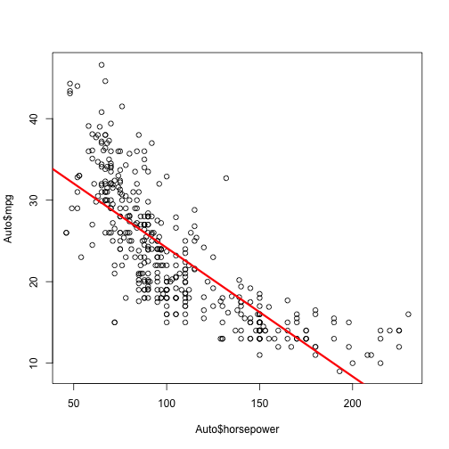

### (a) Simple linear regression

```r
Auto <- read.table("Auto.data",header = T,na.strings = "?")
Auto <- na.omit(Auto)
lm.fit <- lm(mpg ~ horsepower, data = Auto)
summary(lm.fit)
```

```
## 
## Call:
## lm(formula = mpg ~ horsepower, data = Auto)
## 
## Residuals:
##      Min       1Q   Median       3Q      Max 
## -13.5710  -3.2592  -0.3435   2.7630  16.9240 
## 
## Coefficients:
##              Estimate Std. Error t value Pr(>|t|)    
## (Intercept) 39.935861   0.717499   55.66   <2e-16 ***
## horsepower  -0.157845   0.006446  -24.49   <2e-16 ***
## ---
## Signif. codes:  0 '***' 0.001 '**' 0.01 '*' 0.05 '.' 0.1 ' ' 1
## 
## Residual standard error: 4.906 on 390 degrees of freedom
## Multiple R-squared:  0.6059,	Adjusted R-squared:  0.6049 
## F-statistic: 599.7 on 1 and 390 DF,  p-value: < 2.2e-16
```

(i) From the R-square and p-value shown above, ther is a relationship between the predictor horsepower and the response mpg.
(ii) The t-value for the coefficient of horsepower is -24.49, so the relationship is pretty strong.
(iii) The coefficient estimate negative, meaning the relationship is negative.
(iv) See the codes and outputs below:

```r
predict(lm.fit,data.frame(horsepower=8),interval="confidence")
```

```
##       fit      lwr      upr
## 1 38.6731 37.35713 39.98908
```

```r
predict(lm.fit,data.frame(horsepower=8),interval="prediction")
```

```
##       fit     lwr     upr
## 1 38.6731 28.9387 48.4075
```

### (b) Plot the linear regression

```r
plot(Auto$horsepower,Auto$mpg)
abline(lm.fit,lwd=3,col="red")
```

 

### (c) Diagnostic plots of the linear regression

```r
par(mfrow=c(2,2))
plot(lm.fit)
```

 

* From the residual plot, horsepower may be not linear related to mpg.
* From the Q-Q plot, errors are normally distributed.
* From the scale-location plot, the homoscedasticity assumption is held.
* From the residual-vs-leverage plot, no points have large Cook's distance.
