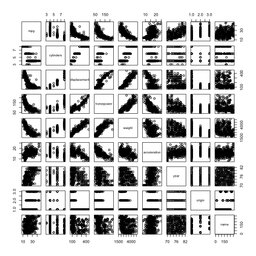

### (a) Scatterplot matrix

```r
Auto <- read.table("Auto.data",header = T,na.strings = "?")
Auto <- na.omit(Auto)
attach(Auto)
```

```
## The following objects are masked from Auto (pos = 3):
## 
##     acceleration, cylinders, displacement, horsepower, mpg, name,
##     origin, weight, year
## 
## The following objects are masked from Auto (pos = 4):
## 
##     acceleration, cylinders, displacement, horsepower, mpg, name,
##     origin, weight, year
## 
## The following objects are masked from Auto (pos = 6):
## 
##     acceleration, cylinders, displacement, horsepower, mpg, name,
##     origin, weight, year
```

```r
pairs(Auto)
```

 

### (b) Correlations

```r
cor(Auto[colnames(Auto) != "name"])
```

```
##                     mpg  cylinders displacement horsepower     weight
## mpg           1.0000000 -0.7776175   -0.8051269 -0.7784268 -0.8322442
## cylinders    -0.7776175  1.0000000    0.9508233  0.8429834  0.8975273
## displacement -0.8051269  0.9508233    1.0000000  0.8972570  0.9329944
## horsepower   -0.7784268  0.8429834    0.8972570  1.0000000  0.8645377
## weight       -0.8322442  0.8975273    0.9329944  0.8645377  1.0000000
## acceleration  0.4233285 -0.5046834   -0.5438005 -0.6891955 -0.4168392
## year          0.5805410 -0.3456474   -0.3698552 -0.4163615 -0.3091199
## origin        0.5652088 -0.5689316   -0.6145351 -0.4551715 -0.5850054
##              acceleration       year     origin
## mpg             0.4233285  0.5805410  0.5652088
## cylinders      -0.5046834 -0.3456474 -0.5689316
## displacement   -0.5438005 -0.3698552 -0.6145351
## horsepower     -0.6891955 -0.4163615 -0.4551715
## weight         -0.4168392 -0.3091199 -0.5850054
## acceleration    1.0000000  0.2903161  0.2127458
## year            0.2903161  1.0000000  0.1815277
## origin          0.2127458  0.1815277  1.0000000
```

### (c) Multiple linear regression

```r
lm.fit <- lm(mpg~.,data = Auto[colnames(Auto) != "name"])
summary(lm.fit)
```

```
## 
## Call:
## lm(formula = mpg ~ ., data = Auto[colnames(Auto) != "name"])
## 
## Residuals:
##     Min      1Q  Median      3Q     Max 
## -9.5903 -2.1565 -0.1169  1.8690 13.0604 
## 
## Coefficients:
##                Estimate Std. Error t value Pr(>|t|)    
## (Intercept)  -17.218435   4.644294  -3.707  0.00024 ***
## cylinders     -0.493376   0.323282  -1.526  0.12780    
## displacement   0.019896   0.007515   2.647  0.00844 ** 
## horsepower    -0.016951   0.013787  -1.230  0.21963    
## weight        -0.006474   0.000652  -9.929  < 2e-16 ***
## acceleration   0.080576   0.098845   0.815  0.41548    
## year           0.750773   0.050973  14.729  < 2e-16 ***
## origin         1.426141   0.278136   5.127 4.67e-07 ***
## ---
## Signif. codes:  0 '***' 0.001 '**' 0.01 '*' 0.05 '.' 0.1 ' ' 1
## 
## Residual standard error: 3.328 on 384 degrees of freedom
## Multiple R-squared:  0.8215,	Adjusted R-squared:  0.8182 
## F-statistic: 252.4 on 7 and 384 DF,  p-value: < 2.2e-16
```

(i) From the overall R-square and p-value, there is a relationship between the predictors and the response.
(ii) Displacement, weight, year and origin are predictors with a statistically significant relationship to the response.
(iii) The coefficient for year is 0.750773, which suggests that newer cars tend to have higher mpg.

### (d) Disgnostic plots

```r
par(mfrow=c(2,2))
plot(lm.fit)
```

 

* The Q-Q plot actually shows that there are some unusually large outliers.
* The residual-vs-leverage plot shows that all residuals have low Cook's distance, with only one point having relatively high leverage.

### (e) Refit with interaction effects

```r
lm.fit <- lm(mpg~weight*year,data = Auto)
summary(lm.fit)
```

```
## 
## Call:
## lm(formula = mpg ~ weight * year, data = Auto)
## 
## Residuals:
##     Min      1Q  Median      3Q     Max 
## -8.0397 -1.9956 -0.0983  1.6525 12.9896 
## 
## Coefficients:
##               Estimate Std. Error t value Pr(>|t|)    
## (Intercept) -1.105e+02  1.295e+01  -8.531 3.30e-16 ***
## weight       2.755e-02  4.413e-03   6.242 1.14e-09 ***
## year         2.040e+00  1.718e-01  11.876  < 2e-16 ***
## weight:year -4.579e-04  5.907e-05  -7.752 8.02e-14 ***
## ---
## Signif. codes:  0 '***' 0.001 '**' 0.01 '*' 0.05 '.' 0.1 ' ' 1
## 
## Residual standard error: 3.193 on 388 degrees of freedom
## Multiple R-squared:  0.8339,	Adjusted R-squared:  0.8326 
## F-statistic: 649.3 on 3 and 388 DF,  p-value: < 2.2e-16
```

The interation of weight and year seems to be statistically significant.

### (f) Tranformation of the variables

```r
lm.fit <- lm(mpg~poly(weight,2),data = Auto)
summary(lm.fit)
```

```
## 
## Call:
## lm(formula = mpg ~ poly(weight, 2), data = Auto)
## 
## Residuals:
##      Min       1Q   Median       3Q      Max 
## -12.6246  -2.7134  -0.3485   1.8267  16.0866 
## 
## Coefficients:
##                   Estimate Std. Error t value Pr(>|t|)    
## (Intercept)        23.4459     0.2109 111.151  < 2e-16 ***
## poly(weight, 2)1 -128.4436     4.1763 -30.755  < 2e-16 ***
## poly(weight, 2)2   23.1589     4.1763   5.545 5.43e-08 ***
## ---
## Signif. codes:  0 '***' 0.001 '**' 0.01 '*' 0.05 '.' 0.1 ' ' 1
## 
## Residual standard error: 4.176 on 389 degrees of freedom
## Multiple R-squared:  0.7151,	Adjusted R-squared:  0.7137 
## F-statistic: 488.3 on 2 and 389 DF,  p-value: < 2.2e-16
```

This also looks like a acceptable model, using weight and squared weight as the predictors.
