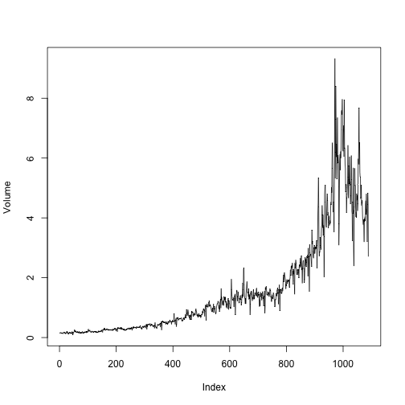
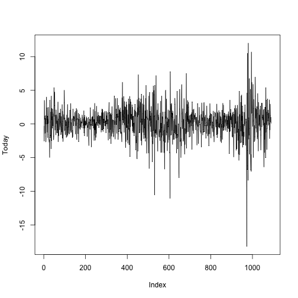

### (a) Summaries of the Weekly data

```r
library(ISLR)
attach(Weekly)
```

```
## The following objects are masked from Weekly (pos = 4):
## 
##     Direction, Lag1, Lag2, Lag3, Lag4, Lag5, Today, Volume, Year
```

```r
names(Weekly)
```

```
## [1] "Year"      "Lag1"      "Lag2"      "Lag3"      "Lag4"      "Lag5"     
## [7] "Volume"    "Today"     "Direction"
```

```r
dim(Weekly)
```

```
## [1] 1089    9
```

```r
summary(Weekly)
```

```
##       Year           Lag1               Lag2               Lag3         
##  Min.   :1990   Min.   :-18.1950   Min.   :-18.1950   Min.   :-18.1950  
##  1st Qu.:1995   1st Qu.: -1.1540   1st Qu.: -1.1540   1st Qu.: -1.1580  
##  Median :2000   Median :  0.2410   Median :  0.2410   Median :  0.2410  
##  Mean   :2000   Mean   :  0.1506   Mean   :  0.1511   Mean   :  0.1472  
##  3rd Qu.:2005   3rd Qu.:  1.4050   3rd Qu.:  1.4090   3rd Qu.:  1.4090  
##  Max.   :2010   Max.   : 12.0260   Max.   : 12.0260   Max.   : 12.0260  
##       Lag4               Lag5              Volume       
##  Min.   :-18.1950   Min.   :-18.1950   Min.   :0.08747  
##  1st Qu.: -1.1580   1st Qu.: -1.1660   1st Qu.:0.33202  
##  Median :  0.2380   Median :  0.2340   Median :1.00268  
##  Mean   :  0.1458   Mean   :  0.1399   Mean   :1.57462  
##  3rd Qu.:  1.4090   3rd Qu.:  1.4050   3rd Qu.:2.05373  
##  Max.   : 12.0260   Max.   : 12.0260   Max.   :9.32821  
##      Today          Direction 
##  Min.   :-18.1950   Down:484  
##  1st Qu.: -1.1540   Up  :605  
##  Median :  0.2410             
##  Mean   :  0.1499             
##  3rd Qu.:  1.4050             
##  Max.   : 12.0260
```

```r
cor(Weekly[,-9])
```

```
##               Year         Lag1        Lag2        Lag3         Lag4
## Year    1.00000000 -0.032289274 -0.03339001 -0.03000649 -0.031127923
## Lag1   -0.03228927  1.000000000 -0.07485305  0.05863568 -0.071273876
## Lag2   -0.03339001 -0.074853051  1.00000000 -0.07572091  0.058381535
## Lag3   -0.03000649  0.058635682 -0.07572091  1.00000000 -0.075395865
## Lag4   -0.03112792 -0.071273876  0.05838153 -0.07539587  1.000000000
## Lag5   -0.03051910 -0.008183096 -0.07249948  0.06065717 -0.075675027
## Volume  0.84194162 -0.064951313 -0.08551314 -0.06928771 -0.061074617
## Today  -0.03245989 -0.075031842  0.05916672 -0.07124364 -0.007825873
##                Lag5      Volume        Today
## Year   -0.030519101  0.84194162 -0.032459894
## Lag1   -0.008183096 -0.06495131 -0.075031842
## Lag2   -0.072499482 -0.08551314  0.059166717
## Lag3    0.060657175 -0.06928771 -0.071243639
## Lag4   -0.075675027 -0.06107462 -0.007825873
## Lag5    1.000000000 -0.05851741  0.011012698
## Volume -0.058517414  1.00000000 -0.033077783
## Today   0.011012698 -0.03307778  1.000000000
```

```r
plot(Volume,type = "l")
```

 

```r
plot(Today,type = "l")
```

 

### (b) Logistic regression with response of Direction 

```r
glm.fit <- glm(Direction~Lag1+Lag2+Lag3+Lag4+Lag5+Volume,data = Weekly,family = binomial)
summary(glm.fit)
```

```
## 
## Call:
## glm(formula = Direction ~ Lag1 + Lag2 + Lag3 + Lag4 + Lag5 + 
##     Volume, family = binomial, data = Weekly)
## 
## Deviance Residuals: 
##     Min       1Q   Median       3Q      Max  
## -1.6949  -1.2565   0.9913   1.0849   1.4579  
## 
## Coefficients:
##             Estimate Std. Error z value Pr(>|z|)   
## (Intercept)  0.26686    0.08593   3.106   0.0019 **
## Lag1        -0.04127    0.02641  -1.563   0.1181   
## Lag2         0.05844    0.02686   2.175   0.0296 * 
## Lag3        -0.01606    0.02666  -0.602   0.5469   
## Lag4        -0.02779    0.02646  -1.050   0.2937   
## Lag5        -0.01447    0.02638  -0.549   0.5833   
## Volume      -0.02274    0.03690  -0.616   0.5377   
## ---
## Signif. codes:  0 '***' 0.001 '**' 0.01 '*' 0.05 '.' 0.1 ' ' 1
## 
## (Dispersion parameter for binomial family taken to be 1)
## 
##     Null deviance: 1496.2  on 1088  degrees of freedom
## Residual deviance: 1486.4  on 1082  degrees of freedom
## AIC: 1500.4
## 
## Number of Fisher Scoring iterations: 4
```

Only Lag2 is statistically significant, while others are not.

### (c) Confusion matrix

```r
glm.probs <- predict(glm.fit,type = "response")
contrasts(Direction)
```

```
##      Up
## Down  0
## Up    1
```

```r
glm.pred <- rep("Down",length(glm.probs))
glm.pred[glm.probs>0.5] <- "Up"
table(glm.pred,Direction)
```

```
##         Direction
## glm.pred Down  Up
##     Down   54  48
##     Up    430 557
```

```r
mean(glm.pred==Direction)
```

```
## [1] 0.5610652
```

### (d) Logistic regression model with Lag2

```r
train <- (Year<=2008)
glm.fit <- glm(Direction~Lag2,data = Weekly,family = binomial,subset = train)
summary(glm.fit)
```

```
## 
## Call:
## glm(formula = Direction ~ Lag2, family = binomial, data = Weekly, 
##     subset = train)
## 
## Deviance Residuals: 
##    Min      1Q  Median      3Q     Max  
## -1.536  -1.264   1.021   1.091   1.368  
## 
## Coefficients:
##             Estimate Std. Error z value Pr(>|z|)   
## (Intercept)  0.20326    0.06428   3.162  0.00157 **
## Lag2         0.05810    0.02870   2.024  0.04298 * 
## ---
## Signif. codes:  0 '***' 0.001 '**' 0.01 '*' 0.05 '.' 0.1 ' ' 1
## 
## (Dispersion parameter for binomial family taken to be 1)
## 
##     Null deviance: 1354.7  on 984  degrees of freedom
## Residual deviance: 1350.5  on 983  degrees of freedom
## AIC: 1354.5
## 
## Number of Fisher Scoring iterations: 4
```

```r
Weekly.test <- Weekly[!train,]
Direction.test <- Direction[!train]
glm.probs <- predict(glm.fit,Weekly.test,type = "response")
glm.pred <- rep("Down",length(glm.probs))
glm.pred[glm.probs>0.5] <- "Up"
table(glm.pred,Direction.test)
```

```
##         Direction.test
## glm.pred Down Up
##     Down    9  5
##     Up     34 56
```

```r
mean(glm.pred==Direction.test)
```

```
## [1] 0.625
```

From the confusion matrix, we can find the Type I error of 5/(5+9)=35.7%, the Type II error of 34/(34+56)=37.8%. Specificity is 64.3%, and sensitivity is 62.2%.

### (e) LDA

```r
library(MASS)
lda.fit <- lda(Direction~Lag2,data = Weekly,subset = train)
lda.fit
```

```
## Call:
## lda(Direction ~ Lag2, data = Weekly, subset = train)
## 
## Prior probabilities of groups:
##      Down        Up 
## 0.4477157 0.5522843 
## 
## Group means:
##             Lag2
## Down -0.03568254
## Up    0.26036581
## 
## Coefficients of linear discriminants:
##            LD1
## Lag2 0.4414162
```

```r
lda.pred <- predict(lda.fit,Weekly.test)
lda.class <- lda.pred$class
table(lda.class,Direction.test)
```

```
##          Direction.test
## lda.class Down Up
##      Down    9  5
##      Up     34 56
```

```r
mean(lda.class==Direction.test)
```

```
## [1] 0.625
```

### (f) QDA

```r
qda.fit <- qda(Direction~Lag2,data = Weekly,subset = train)
qda.fit
```

```
## Call:
## qda(Direction ~ Lag2, data = Weekly, subset = train)
## 
## Prior probabilities of groups:
##      Down        Up 
## 0.4477157 0.5522843 
## 
## Group means:
##             Lag2
## Down -0.03568254
## Up    0.26036581
```

```r
qda.pred <- predict(qda.fit,Weekly.test)
qda.class <- qda.pred$class
table(qda.class,Direction.test)
```

```
##          Direction.test
## qda.class Down Up
##      Down    0  0
##      Up     43 61
```

```r
mean(qda.class==Direction.test)
```

```
## [1] 0.5865385
```

### (g) KNN with K=1

```r
library(class)
train.X <- data.frame(Lag2[train])
test.X <- data.frame(Lag2[!train])
train.Direction <- Direction[train]
set.seed(1)
knn.pred <- knn(train.X,test.X,train.Direction,k=1)
table(knn.pred,Direction.test)
```

```
##         Direction.test
## knn.pred Down Up
##     Down   21 30
##     Up     22 31
```

```r
mean(knn.pred==Direction.test)
```

```
## [1] 0.5
```

### (h) Best models
As we have shown above, it seems that the logistic regression and LDA perform better among all 4 models.


### (i) Refit with new combinations of predictors

```r
# Logistic regression
glm.fit <- glm(Direction~Lag1+Lag2,data = Weekly,family = binomial,subset = train)
summary(glm.fit)
```

```
## 
## Call:
## glm(formula = Direction ~ Lag1 + Lag2, family = binomial, data = Weekly, 
##     subset = train)
## 
## Deviance Residuals: 
##     Min       1Q   Median       3Q      Max  
## -1.6149  -1.2565   0.9989   1.0875   1.5330  
## 
## Coefficients:
##             Estimate Std. Error z value Pr(>|z|)   
## (Intercept)  0.21109    0.06456   3.269  0.00108 **
## Lag1        -0.05421    0.02886  -1.878  0.06034 . 
## Lag2         0.05384    0.02905   1.854  0.06379 . 
## ---
## Signif. codes:  0 '***' 0.001 '**' 0.01 '*' 0.05 '.' 0.1 ' ' 1
## 
## (Dispersion parameter for binomial family taken to be 1)
## 
##     Null deviance: 1354.7  on 984  degrees of freedom
## Residual deviance: 1347.0  on 982  degrees of freedom
## AIC: 1353
## 
## Number of Fisher Scoring iterations: 4
```

```r
glm.probs <- predict(glm.fit,Weekly.test,type = "response")
glm.pred <- rep("Down",length(glm.probs))
glm.pred[glm.probs>0.5] <- "Up"
table(glm.pred,Direction.test)
```

```
##         Direction.test
## glm.pred Down Up
##     Down    7  8
##     Up     36 53
```

```r
mean(glm.pred==Direction.test)
```

```
## [1] 0.5769231
```

```r
# LDA
lda.fit <- lda(Direction~Lag1+Lag2,data = Weekly,subset = train)
lda.fit
```

```
## Call:
## lda(Direction ~ Lag1 + Lag2, data = Weekly, subset = train)
## 
## Prior probabilities of groups:
##      Down        Up 
## 0.4477157 0.5522843 
## 
## Group means:
##              Lag1        Lag2
## Down  0.289444444 -0.03568254
## Up   -0.009213235  0.26036581
## 
## Coefficients of linear discriminants:
##             LD1
## Lag1 -0.3013148
## Lag2  0.2982579
```

```r
lda.pred <- predict(lda.fit,Weekly.test)
lda.class <- lda.pred$class
table(lda.class,Direction.test)
```

```
##          Direction.test
## lda.class Down Up
##      Down    7  8
##      Up     36 53
```

```r
mean(lda.class==Direction.test)
```

```
## [1] 0.5769231
```

```r
# QDA
qda.fit <- qda(Direction~Lag2,data = Weekly,subset = train)
qda.fit
```

```
## Call:
## qda(Direction ~ Lag2, data = Weekly, subset = train)
## 
## Prior probabilities of groups:
##      Down        Up 
## 0.4477157 0.5522843 
## 
## Group means:
##             Lag2
## Down -0.03568254
## Up    0.26036581
```

```r
qda.pred <- predict(qda.fit,Weekly.test)
qda.class <- qda.pred$class
table(qda.class,Direction.test)
```

```
##          Direction.test
## qda.class Down Up
##      Down    0  0
##      Up     43 61
```

```r
mean(qda.class==Direction.test)
```

```
## [1] 0.5865385
```

```r
# KNN
train.X <- data.frame(cbind(Lag1,Lag2)[train,])
test.X <- data.frame(cbind(Lag1,Lag2)[!train,])
train.Direction <- Direction[train]
set.seed(1)
knn.pred <- knn(train.X,test.X,train.Direction,k=7)
table(knn.pred,Direction.test)
```

```
##         Direction.test
## knn.pred Down Up
##     Down   22 28
##     Up     21 33
```

```r
mean(knn.pred==Direction.test)
```

```
## [1] 0.5288462
```
