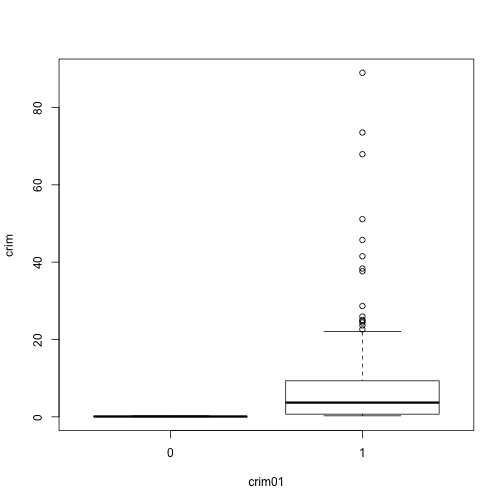
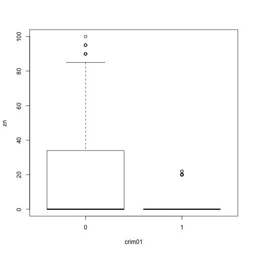
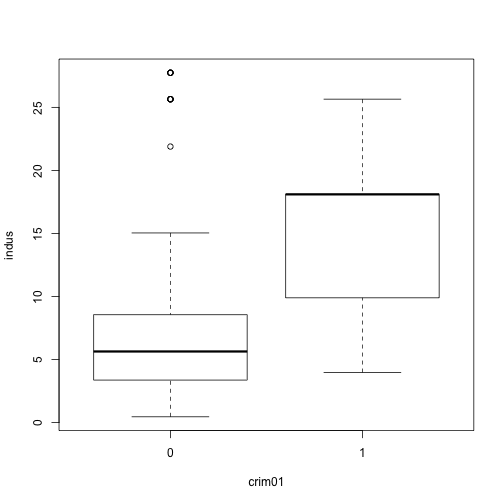
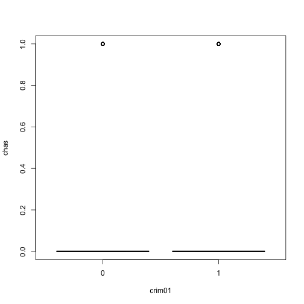
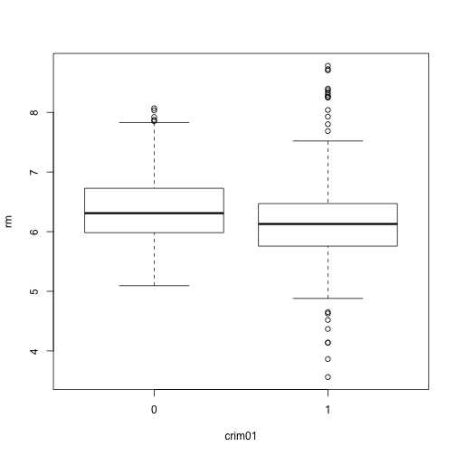
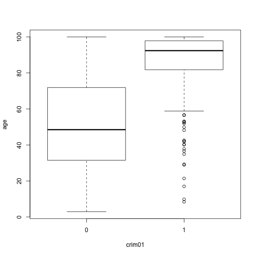
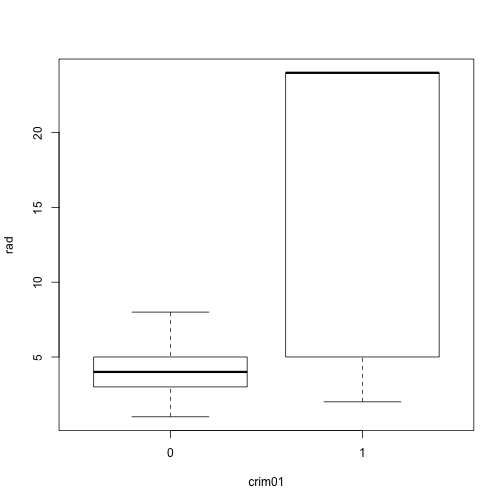

### (a) Create binary variable mpg01

```r
library(ISLR)
attach(Auto)
```

```
## The following objects are masked from Auto (pos = 4):
## 
##     acceleration, cylinders, displacement, horsepower, mpg, name,
##     origin, weight, year
## 
## The following objects are masked from Auto (pos = 8):
## 
##     acceleration, cylinders, displacement, horsepower, mpg, name,
##     origin, weight, year
```

```r
mpg01 <- mpg*0
mpg01[mpg>median(mpg)] <- 1
Auto_new <- data.frame(Auto,mpg01)
```

### (b) Explore the association between mpg01 and other features

```r
for (i in 1:8) {
  boxplot(Auto[,i]~mpg01,xlab="mpg01",ylab=names(Auto)[i])
}
```

        

```r
plot(mpg01,name)
```

 

Displacement, horsepower and weight all seem to associate with mpg01. Among these three, displacement looks the best and we will take it for the following questions.

### (c) Split data into training and test

```r
set.seed(1)
train <- sample(1:length(mpg01),length(mpg01)/2)
```

### (d) LDA

```r
library(MASS)
lda.fit <- lda(mpg01~displacement,data = Auto_new,subset = train)
lda.fit
```

```
## Call:
## lda(mpg01 ~ displacement, data = Auto_new, subset = train)
## 
## Prior probabilities of groups:
##         0         1 
## 0.5255102 0.4744898 
## 
## Group means:
##   displacement
## 0     272.6214
## 1     123.9140
## 
## Coefficients of linear discriminants:
##                     LD1
## displacement 0.01399832
```

```r
lda.pred <- predict(lda.fit,Auto_new[-train,])
lda.class <- lda.pred$class
table(lda.class,mpg01[-train])
```

```
##          
## lda.class   0   1
##         0  78   0
##         1  15 103
```

```r
mean(lda.class==mpg01[-train])
```

```
## [1] 0.9234694
```

### (e) QDA

```r
qda.fit <- qda(mpg01~displacement,data = Auto_new,subset = train)
qda.fit
```

```
## Call:
## qda(mpg01 ~ displacement, data = Auto_new, subset = train)
## 
## Prior probabilities of groups:
##         0         1 
## 0.5255102 0.4744898 
## 
## Group means:
##   displacement
## 0     272.6214
## 1     123.9140
```

```r
qda.pred <- predict(qda.fit,Auto_new[-train,])
qda.class <- qda.pred$class
table(qda.class,mpg01[-train])
```

```
##          
## qda.class   0   1
##         0  78   0
##         1  15 103
```

```r
mean(qda.class==mpg01[-train])
```

```
## [1] 0.9234694
```

### (f) Logistic regression model

```r
glm.fit <- glm(mpg01~displacement,data = Auto_new,family = binomial,subset = train)
summary(glm.fit)
```

```
## 
## Call:
## glm(formula = mpg01 ~ displacement, family = binomial, data = Auto_new, 
##     subset = train)
## 
## Deviance Residuals: 
##      Min        1Q    Median        3Q       Max  
## -2.41424  -0.42822  -0.07353   0.53581   3.03090  
## 
## Coefficients:
##              Estimate Std. Error z value Pr(>|z|)    
## (Intercept)   4.71888    0.62415   7.560 4.02e-14 ***
## displacement -0.02658    0.00360  -7.382 1.56e-13 ***
## ---
## Signif. codes:  0 '***' 0.001 '**' 0.01 '*' 0.05 '.' 0.1 ' ' 1
## 
## (Dispersion parameter for binomial family taken to be 1)
## 
##     Null deviance: 271.20  on 195  degrees of freedom
## Residual deviance: 136.94  on 194  degrees of freedom
## AIC: 140.94
## 
## Number of Fisher Scoring iterations: 6
```

```r
glm.probs <- predict(glm.fit,Auto_new[-train,],type = "response")
glm.pred <- rep(0,length(mpg01[-train]))
glm.pred[glm.probs>0.5] <- 1
table(glm.pred,mpg01[-train])
```

```
##         
## glm.pred   0   1
##        0  78   1
##        1  15 102
```

```r
mean(glm.pred==mpg01[-train])
```

```
## [1] 0.9183673
```

### (g) KNN

```r
library(class)
train.X <- data.frame(displacement[train])
test.X <- data.frame(displacement[-train])
set.seed(1)
knn.pred <- knn(train.X,test.X,mpg01[train],k=1)
table(knn.pred,mpg01[-train])
```

```
##         
## knn.pred  0  1
##        0 77  5
##        1 16 98
```

```r
mean(knn.pred==mpg01[-train])
```

```
## [1] 0.8928571
```

```r
set.seed(1)
knn.pred <- knn(train.X,test.X,mpg01[train],k=4)
table(knn.pred,mpg01[-train])
```

```
##         
## knn.pred   0   1
##        0  79   1
##        1  14 102
```

```r
mean(knn.pred==mpg01[-train])
```

```
## [1] 0.9234694
```
