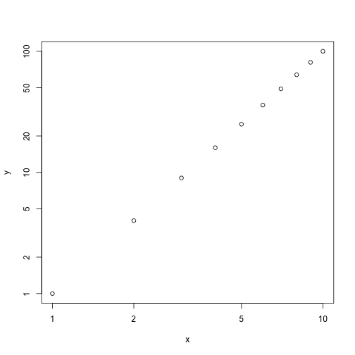
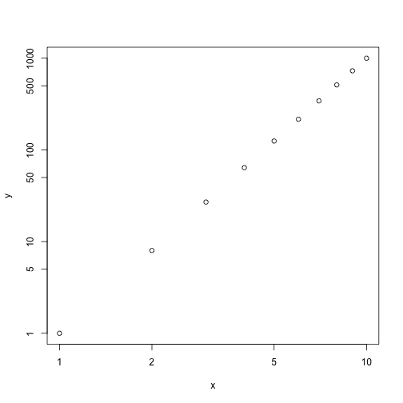

### (a) Simple function Power

```r
Power <- function() {
  print(2^3)
}
Power()
```

```
## [1] 8
```

### (b) New function Power2

```r
Power2 <- function(x,a) {
  print(x^a)
}
Power2(3,8)
```

```
## [1] 6561
```

### (c) Test function Power2

```r
Power2(10,3)
```

```
## [1] 1000
```

```r
Power2(8,17)
```

```
## [1] 2.2518e+15
```

```r
Power2(131,3)
```

```
## [1] 2248091
```

### (d) New function Power3

```r
Power3 <- function(x,a) {
  result <- x^a
  return(result)
}
```

### (e) Test function Power3

```r
x <- 1:10
y <- Power3(x,2)
plot(x,y,log = "xy")
```

 

### (f) New function PlotPower

```r
PlotPower <- function(x,a) {
  y <- Power3(x,a)
  plot(x,y,log = "xy")
}
PlotPower(1:10,3)
```

 
