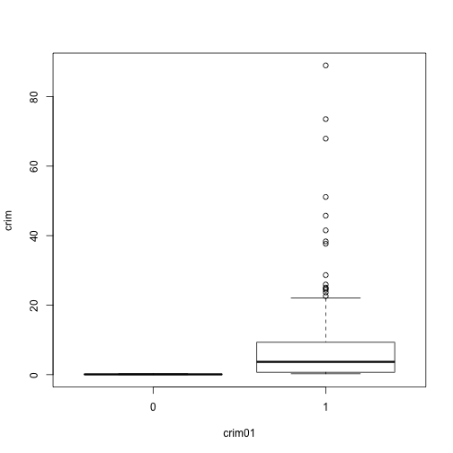
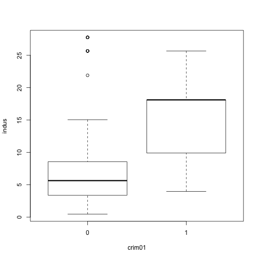
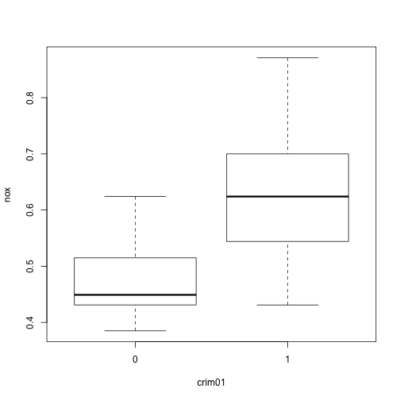
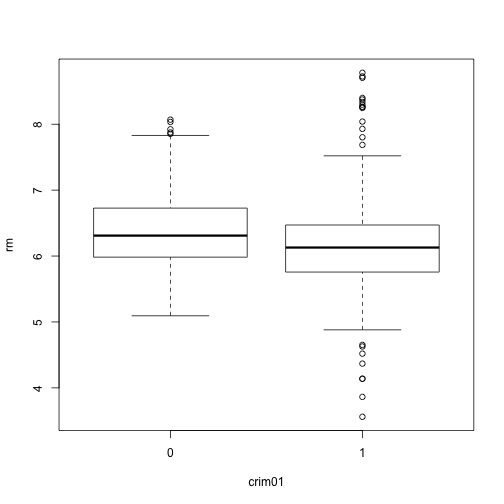
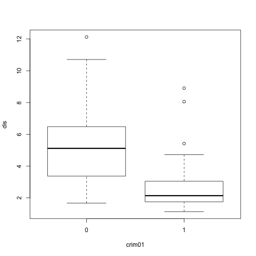
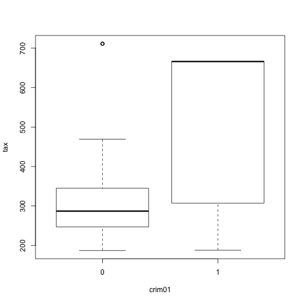

### (a) Create binary variable crim01

```r
library(MASS)
library(ISLR)
attach(Boston)
```

```
## The following objects are masked from Boston (pos = 3):
## 
##     age, black, chas, crim, dis, indus, lstat, medv, nox, ptratio,
##     rad, rm, tax, zn
## 
## The following objects are masked from Boston (pos = 4):
## 
##     age, black, chas, crim, dis, indus, lstat, medv, nox, ptratio,
##     rad, rm, tax, zn
## 
## The following objects are masked from Boston (pos = 5):
## 
##     age, black, chas, crim, dis, indus, lstat, medv, nox, ptratio,
##     rad, rm, tax, zn
## 
## The following objects are masked from Boston (pos = 7):
## 
##     age, black, chas, crim, dis, indus, lstat, medv, nox, ptratio,
##     rad, rm, tax, zn
```

```r
crim01 <- crim*0
crim01[crim>median(crim)] <- 1
Boston_new <- data.frame(Boston,crim01)
```

### (b) Explore the association between crim01 and other features

```r
for (i in 1:14) {
  boxplot(Boston[,i]~crim01,xlab="crim01",ylab=names(Boston)[i])
}
```

              

Indus, nox, age, dis and rad all seem to associate with crim01. Among these three, nox looks the best and we will take it for the following questions.

### (c) Split data into training and test

```r
set.seed(1)
train <- sample(1:length(crim01),length(crim01)/2)
```

### (d) LDA

```r
lda.fit <- lda(crim01~nox,data = Boston_new,subset = train)
lda.fit
```

```
## Call:
## lda(crim01 ~ nox, data = Boston_new, subset = train)
## 
## Prior probabilities of groups:
##         0         1 
## 0.5019763 0.4980237 
## 
## Group means:
##         nox
## 0 0.4697220
## 1 0.6469683
## 
## Coefficients of linear discriminants:
##          LD1
## nox 12.46872
```

```r
lda.pred <- predict(lda.fit,Boston_new[-train,])
lda.class <- lda.pred$class
table(lda.class,crim01[-train])
```

```
##          
## lda.class   0   1
##         0 111  36
##         1  15  91
```

```r
mean(lda.class==crim01[-train])
```

```
## [1] 0.798419
```

### (e) QDA

```r
qda.fit <- qda(crim01~nox,data = Boston_new,subset = train)
qda.fit
```

```
## Call:
## qda(crim01 ~ nox, data = Boston_new, subset = train)
## 
## Prior probabilities of groups:
##         0         1 
## 0.5019763 0.4980237 
## 
## Group means:
##         nox
## 0 0.4697220
## 1 0.6469683
```

```r
qda.pred <- predict(qda.fit,Boston_new[-train,])
qda.class <- qda.pred$class
table(qda.class,crim01[-train])
```

```
##          
## qda.class   0   1
##         0 111  36
##         1  15  91
```

```r
mean(qda.class==crim01[-train])
```

```
## [1] 0.798419
```

### (f) Logistic regression model

```r
glm.fit <- glm(crim01~nox,data = Boston_new,family = binomial,subset = train)
summary(glm.fit)
```

```
## 
## Call:
## glm(formula = crim01 ~ nox, family = binomial, data = Boston_new, 
##     subset = train)
## 
## Deviance Residuals: 
##     Min       1Q   Median       3Q      Max  
## -2.1870  -0.3381  -0.1196   0.2386   2.6776  
## 
## Coefficients:
##             Estimate Std. Error z value Pr(>|z|)    
## (Intercept)  -17.727      2.296  -7.719 1.17e-14 ***
## nox           32.877      4.312   7.625 2.45e-14 ***
## ---
## Signif. codes:  0 '***' 0.001 '**' 0.01 '*' 0.05 '.' 0.1 ' ' 1
## 
## (Dispersion parameter for binomial family taken to be 1)
## 
##     Null deviance: 350.73  on 252  degrees of freedom
## Residual deviance: 143.67  on 251  degrees of freedom
## AIC: 147.67
## 
## Number of Fisher Scoring iterations: 6
```

```r
glm.probs <- predict(glm.fit,Boston_new[-train,],type = "response")
glm.pred <- rep(0,length(crim01[-train]))
glm.pred[glm.probs>0.5] <- 1
table(glm.pred,crim01[-train])
```

```
##         
## glm.pred   0   1
##        0 107  32
##        1  19  95
```

```r
mean(glm.pred==crim01[-train])
```

```
## [1] 0.798419
```

### (g) KNN

```r
library(class)
train.X <- data.frame(nox[train])
test.X <- data.frame(nox[-train])
set.seed(1)
knn.pred <- knn(train.X,test.X,crim01[train],k=1)
table(knn.pred,crim01[-train])
```

```
##         
## knn.pred   0   1
##        0 121  10
##        1   5 117
```

```r
mean(knn.pred==crim01[-train])
```

```
## [1] 0.9407115
```

```r
set.seed(1)
knn.pred <- knn(train.X,test.X,crim01[train],k=3)
table(knn.pred,crim01[-train])
```

```
##         
## knn.pred   0   1
##        0 113   7
##        1  13 120
```

```r
mean(knn.pred==crim01[-train])
```

```
## [1] 0.9209486
```
