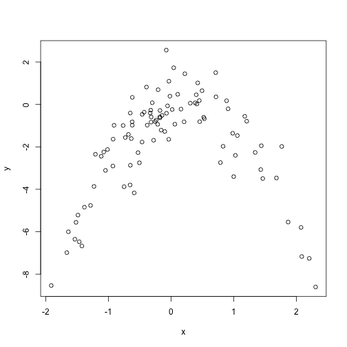

### (a) Simulated data set

```r
set.seed(1)
y <- rnorm(100)
x <- rnorm(100)
y <- x-2*x^2+rnorm(100)
```

In this data set,n is 100 and p is 3.
The equation is: y = 0 + x - 2 * x^2

### (b) Scatterplot

```r
plot(x,y)
```

 

### (c) LOOCV errors

```r
library(boot)
set.seed(2)
cv.err <- rep(0,4)
sim.data <- data.frame(x,y)
for (i in 1:4) {
  glm.fit <- glm(y~poly(x,i),data = sim.data)
  show(summary(glm.fit))
  cv.err[i] <- cv.glm(sim.data,glm.fit)$delta[1]
}
```

```
## 
## Call:
## glm(formula = y ~ poly(x, i), data = sim.data)
## 
## Deviance Residuals: 
##     Min       1Q   Median       3Q      Max  
## -7.3469  -0.9275   0.8028   1.5608   4.3974  
## 
## Coefficients:
##             Estimate Std. Error t value Pr(>|t|)    
## (Intercept)  -1.8277     0.2362  -7.737 9.18e-12 ***
## poly(x, i)    2.3164     2.3622   0.981    0.329    
## ---
## Signif. codes:  0 '***' 0.001 '**' 0.01 '*' 0.05 '.' 0.1 ' ' 1
## 
## (Dispersion parameter for gaussian family taken to be 5.580018)
## 
##     Null deviance: 552.21  on 99  degrees of freedom
## Residual deviance: 546.84  on 98  degrees of freedom
## AIC: 459.69
## 
## Number of Fisher Scoring iterations: 2
## 
## 
## Call:
## glm(formula = y ~ poly(x, i), data = sim.data)
## 
## Deviance Residuals: 
##      Min        1Q    Median        3Q       Max  
## -2.89884  -0.53765   0.04135   0.61490   2.73607  
## 
## Coefficients:
##             Estimate Std. Error t value Pr(>|t|)    
## (Intercept)  -1.8277     0.1032 -17.704   <2e-16 ***
## poly(x, i)1   2.3164     1.0324   2.244   0.0271 *  
## poly(x, i)2 -21.0586     1.0324 -20.399   <2e-16 ***
## ---
## Signif. codes:  0 '***' 0.001 '**' 0.01 '*' 0.05 '.' 0.1 ' ' 1
## 
## (Dispersion parameter for gaussian family taken to be 1.06575)
## 
##     Null deviance: 552.21  on 99  degrees of freedom
## Residual deviance: 103.38  on 97  degrees of freedom
## AIC: 295.11
## 
## Number of Fisher Scoring iterations: 2
## 
## 
## Call:
## glm(formula = y ~ poly(x, i), data = sim.data)
## 
## Deviance Residuals: 
##      Min        1Q    Median        3Q       Max  
## -2.87250  -0.53881   0.02862   0.59383   2.74350  
## 
## Coefficients:
##             Estimate Std. Error t value Pr(>|t|)    
## (Intercept)  -1.8277     0.1037 -17.621   <2e-16 ***
## poly(x, i)1   2.3164     1.0372   2.233   0.0279 *  
## poly(x, i)2 -21.0586     1.0372 -20.302   <2e-16 ***
## poly(x, i)3  -0.3048     1.0372  -0.294   0.7695    
## ---
## Signif. codes:  0 '***' 0.001 '**' 0.01 '*' 0.05 '.' 0.1 ' ' 1
## 
## (Dispersion parameter for gaussian family taken to be 1.075883)
## 
##     Null deviance: 552.21  on 99  degrees of freedom
## Residual deviance: 103.28  on 96  degrees of freedom
## AIC: 297.02
## 
## Number of Fisher Scoring iterations: 2
## 
## 
## Call:
## glm(formula = y ~ poly(x, i), data = sim.data)
## 
## Deviance Residuals: 
##     Min       1Q   Median       3Q      Max  
## -2.8914  -0.5244   0.0749   0.5932   2.7796  
## 
## Coefficients:
##             Estimate Std. Error t value Pr(>|t|)    
## (Intercept)  -1.8277     0.1041 -17.549   <2e-16 ***
## poly(x, i)1   2.3164     1.0415   2.224   0.0285 *  
## poly(x, i)2 -21.0586     1.0415 -20.220   <2e-16 ***
## poly(x, i)3  -0.3048     1.0415  -0.293   0.7704    
## poly(x, i)4  -0.4926     1.0415  -0.473   0.6373    
## ---
## Signif. codes:  0 '***' 0.001 '**' 0.01 '*' 0.05 '.' 0.1 ' ' 1
## 
## (Dispersion parameter for gaussian family taken to be 1.084654)
## 
##     Null deviance: 552.21  on 99  degrees of freedom
## Residual deviance: 103.04  on 95  degrees of freedom
## AIC: 298.78
## 
## Number of Fisher Scoring iterations: 2
```

```r
cv.err
```

```
## [1] 5.890979 1.086596 1.102585 1.114772
```

### (d) LOOCV errors again

```r
set.seed(3)
cv.err <- rep(0,4)
sim.data <- data.frame(x,y)
for (i in 1:4) {
  glm.fit <- glm(y~poly(x,i),data = sim.data)
  cv.err[i] <- cv.glm(sim.data,glm.fit)$delta[1]
}
cv.err
```

```
## [1] 5.890979 1.086596 1.102585 1.114772
```

The result is exactly the same, because LOOCV is not affected by random seeds.

### (e) Model ii has the smallest LOOCV error, just as expected.

### (f) From the statistical significance, Model ii still is the best one, as expected.
